# [P4 WATCH-O-TRON](https://apeskinian-watch-o-tron-f4512ce56f33.herokuapp.com)

[](https://github.com/apeskinian/p4_watch-o-tron/commits/main)
[](https://github.com/apeskinian/p4_watch-o-tron/commits/main)
[](https://github.com/apeskinian/p4_watch-o-tron)

**Watch-O-Tron: A Comprehensive Watch Collection Management Tool**

Watch-O-Tron is a versatile tool designed to efficiently manage your watch collection. It enables you to meticulously track all your watches, including detailed information such as make, model, and brand collection. Additionally, movement details can be stored, encompassing type and specific movement model information. For watches with intricate complications, these can be noted and highlighted with user-friendly icons during watch viewing. Furthermore, an image can be uploaded for each watch.

While it is recommended to have all watch details readily available, the only essential information required to store a watch is it's make and movement type.

Watch-O-Tron offers the flexibility to revisit and edit watch details at your convenience. You can also delete watches and transfer them between different lists.

As watch enthusiasts often acquire new watches, Watch-O-Tron provides a convenient feature to add watches to a wish list for desired watches. Upon making a purchase, you can effortlessly transfer the watch to your collection by using the purchased button.

Staff members also have access to the staff settings area, which grants them the ability to add, edit, and remove custom movements and list types. However, default movements and lists cannot be modified.


Template source: [mockupworld](https://www.mockupworld.co/free/set-of-clean-apple-device-mockups/)

## UX

#### Strategy
Create a feature rich web app for watch enthusiasts which enables them to manage and track their collections.

#### Scope
Features I wanted to include were:

  - Separate accounts for every user so their collection remains private.
  - The ability for a user to add watches to the app with accompanying details.
  - Have a collection and wish list section to enable grouping of watches.
  - The ability to edit and delete watches.
  - Be able to move watches from a wish list to a collection in a simple step.
  - Have a staff level user which gives them access to a settings page to add, edit and remove custom movements and lists.
  - Some Easter eggs for users to find.

#### Structure
The site would be based around a main home page that displays a users watches. Mobile users will navigate the site via a pop up menu situated at the bottom of the screen for easier access. When viewed on larger screens the navigation will move to the top. Available lists will be clickable with the current list being highlighted. When a user selects a new list the page will update and display the watches in the newly selected list. The default lists are "Collection" and 'Wish List", these will always be available to view. Any other lists created by staff will only be available to view if the user has added watches to them.

The button to add a watch will be easily accessible via the menu on mobile devices and at the bottom of screen larger devices. Adding and editing a watch will present a new page to the user specifically for data input. When they submit the new watch info it is presented back to them for confirmation before being added to a chosen list.

The user will also have confirmation of their login displayed along with a button to logout.

If the user is staff level or super user they will be informed and also have extra navigation options. Staff members will have access to the staff settings page and super users will have access to the staff settings and additionally the Django admin panel for the site.

The staff settings page will have tables to show the current movements and lists available for users. Staff members can add, edit and delete any new movements or lists created. The default lists "Collection" and "Wish List" cannot be changed or deleted. Also the default movement types cannot be changed or deleted. The staff settings page enables a client to update the app in response to users requests.

#### Skeleton
In the wireframing process I decided the navigation should be simple and remain constant throughout the site where possible. Having navigation on the bottom for mobile devices makes it easier for the user to interact with while keeping the screen visible. The navigation would move to the top for larger screens for a more traditional layout. Clicking on a watch will present you with the action buttons for each watch. An edit logo on the image and cursor change will indicate that this can be done.

### Colour Scheme
Because watches come in a multitude of colours and patterns, I decided to go with a neutral monochrome scheme for the site with only the action buttons and main logo having colour. This in turn creates a personal colour scheme for each user as the images of the watches they upload will influence the colour scheme of the site.

For the action buttons I used the Bootstrap 5 standard colour schemes trying keeping each colour to a specific type of action. This would lead the user naturally to each button when presented, depending on what they wanted to do.

| Colour Ref | Site Elements |
| --- | --- |
| `rgb(220, 220, 220)` | Main site background |
| `#FFF` | Navigation background |
| `rgb(240, 240, 240)` | Mobile nav item backgrounds |
| `rgb(220, 220, 220)` | Mobile active nav item background |
| `rgb(220, 220, 220)` | Edit modal background |
| `rgb(240, 240, 240)` | Login / Logout / Signup content background |
| `rgb(240, 240, 240)` | Staff settings content background |
| `#CC0000` | Main logo clock hands |

| Colour Ref | Buttons | Action Type |
| --- | --- | --- |
| bootstrap `danger` | Sign Out / Delete buttons | Destructive |
| bootstrap `success` | Sign In / Add a Watch / Add / Confirm / Amend buttons | Constructive |
| bootstrap `primary` | Sign Up / Staff Settings / Purchased / Cancel buttons | Progress |
| bootstrap `warning` | Edit buttons | Alteration |
| bootstrap `secondary` | Admin Panel button | Admin |

### Typography

- [Ubuntu Mono](https://fonts.google.com/specimen/Ubuntu+Mono) was used for the main logo and buttons.

- [Source Sans 3](https://fonts.google.com/specimen/Source+Sans+3) was used for all other text.

- [Font Awesome](https://fontawesome.com) icons were used for the mobile navigation menu icon, pagination icons and watch edit indicator.

#### Complication Icons

Some icons from [Font Awesome](https://fontawesome.com) were used and some were create by myself.
| Complication | Source |
| --- | --- |
| Chronograph | [Font Awesome](https://fontawesome.com/icons/stopwatch?f=classic&s=solid) |
| Day | Custom |
| Date | Custom |
| GMT | [Font Awesome](https://fontawesome.com/icons/plane?f=classic&s=solid) |
| World Timer | [Font Awesome](https://fontawesome.com/icons/earth-americas?f=classic&s=solid) |
| Moonphase | Custom |
| Power Reserve | Custom |
| Tourbillon | Custom |

## User Stories

### New Site Users

- As a new site user I can sign up for an account so that I can login and use the app.

### Returning Site Users

- As a site user I can log in so that I can use the app.
- As a site user I can logout so that I can keep my data private.
- As a site user I am notified on successful login and logout so that I know that I know that I am logged in or out.
- As a site user I can view my watch collection so that I can view images and details of the watches I own.
- As a site user I can view my wish list so that I can see what watches I want or plan my next purchase.
- As a site user I can view watches that I have placed in potentially added new list types so that see the watch details for this list.
- As a site user I can see the details of each watch so that I can find out more information about them.
- As a site user I am notified when I have switched views to a new list so that I know which list I am viewing.
- As a site user I can add a new watch so that I ca see it in my collection or wish list.
- As a site user I am asked to confirm new watch details I entered are correct so that no accidental erroneous data is saved.
- As a site user I am notified when a watch has been added successfully so that I know the addition was successful or not.
- As a site user I can see a spinner when I click add watch so that I know something is happening.
- As a site user I should be prompted to confirm watch deletions so that I do not delete watches by accident.
- As a site user I can edit stored watches in my collection so that I can add more detail or update existing information.
- As a site user I can move a watch in my wish list to my collection so that I know that I have purchased it.
- As a site user I can delete a watch from the wish list so that I can update my wish list should I no longer want a particular watch.
- As a site user I can delete a watch from a new list type so that I can update this list when I no longer want the watch to appear in it.
- As a site user I can edit stored watches in my wish list so that I can add more detail or update existing information.
- As a site user I can edit stored watches in a new list type so that I can add more detail or update existing information.
- As a site user I can delete a watch from a my collection so that update my lists if I no longer own a particular watch.
- As a site user I should be prompted to confirm alterations so that edits are correct.
- As a site user I should be asked to confirm when I set a watch as purchased so that I don't accidentally move a watch to my collection if I haven't bought it.
- As a site user I am notified after editing and deleting watches so that I know if the process was successful.
- As a site user I am notified when I move a watch to the collection so that it is confirmed whether the process was successful.
- As a site user I can see a spinner when I confirm a watch edit so that I know something is happening.
- As a curious site user I can discover a hidden Easter egg in the site logo so that I experience an unexpected, delightful surprise within the application.
- As a curious site user I can discover a hidden Easter egg in the date complication icon so that I experience an unexpected, delightful surprise within the application.
- As a curious site user I can discover a hidden Easter egg in the day complication icon so that I experience an unexpected, delightful surprise within the application.
- As a curious site user I can discover a hidden Easter egg in the moon phase complication icon so that I experience an unexpected, delightful surprise within the application.
- As a site user I can post in a forum and comment on posts so that I can connect with other like minded users.
- As a site user I can send direct messages to other users so that I can have private conversations with other users.
- As a site user I can delete my account so that the app no longer stores any of my information.

### Staff Member

- As a client I can login as a staff member so that I can add potential new important options for users.
- As a site staff member I can add new watch movement types to the model so that users can add watches with any new movement types that may become available in the future.
- As a site staff member I can add new list types so that users can expand their lists from collection and wish list to other types specified by the site staff member.
- As a site staff member I can edit any movement types I have added so that I change them if needed.
- As a site staff member I can delete any new movement types so that I can keep the list relevant.
- As a site staff membe I can edit any added list types so that keep the app up to date.
- As a site staff member I can delete custom added lists so that remove any unwanted list types.
- As a staff member I am notified about edits and deletes I make for custom movements so that I know if the change was successful.
- As a staff member I am notified of successful list edits and deletions so that I know the process was successful.

### Site Admin

- As a site admin I can log in as a super user so that I can access the admin panel.

## Wireframes

To follow best practice, wireframes were developed for mobile, tablet, and desktop sizes.
I've used [Balsamiq](https://balsamiq.com/wireframes) to design my site wireframes.

### Mobile Wireframes

| Log In / Register | Homepage | Homepage Showing Detail | Homepage Expanded Menu | Wish List Showing Detail | Add/Edit | Add/Edit Expanded Menu | Add/Edit Confirmation | Staff Member Homepage Expanded Menu | Staff Member Add/Edit | Staff Member Add/Edit Expanded Menu |
| :---: | :---: | :---: | :---: | :---: | :---: | :---: | :---: | :---: | :---: | :---: |
|  |  |  | 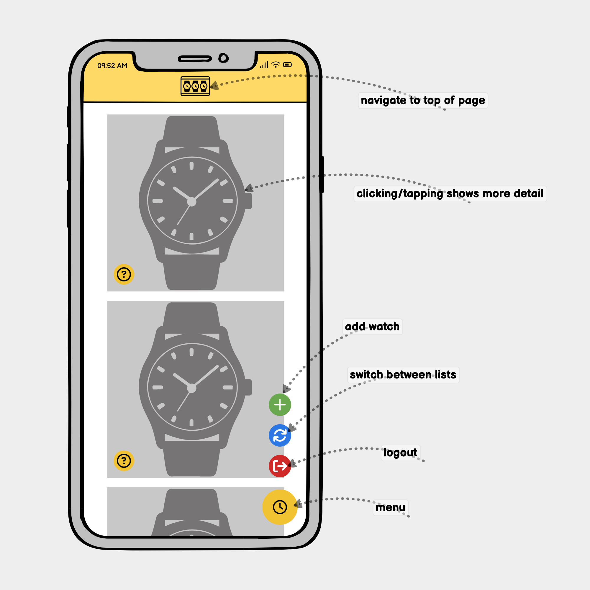 |  |  |  |  | 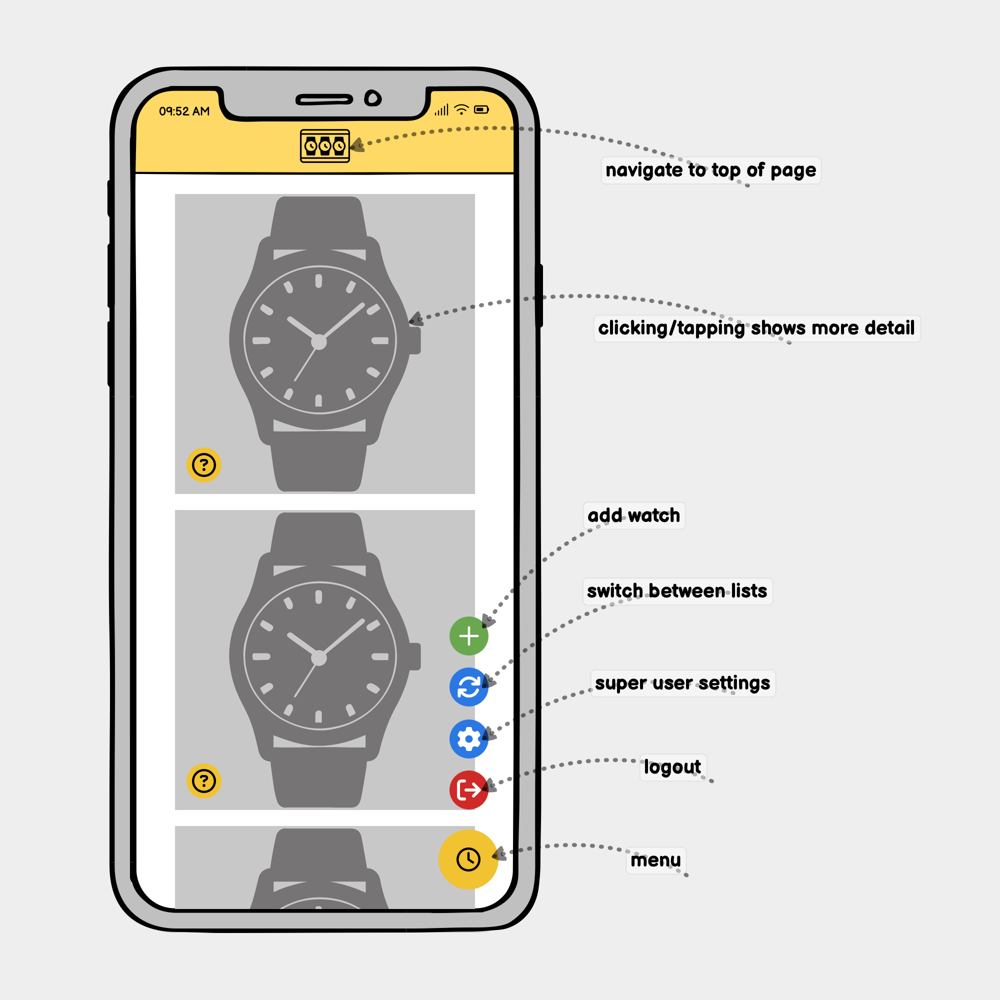 |  |  |

### Tablet Wireframes

| Log In / Register | Homepage | Homepage Showing Detail | Homepage Expanded Menu | Wish List Showing Detail | Add/Edit | Add/Edit Expanded Menu | Add/Edit Confirmation | Staff Member Homepage Expanded Menu | Staff Member Add/Edit | Staff Member Add/Edit Expanded Menu |
| :---: | :---: | :---: | :---: | :---: | :---: | :---: | :---: | :---: | :---: | :---: |
|  |  |  |  |  |  |  |  |  |  |  |

### Desktop Wireframes

| Log In / Register | Homepage | Homepage Showing Detail | Homepage Expanded Menu | Wish List Showing Detail | Add/Edit | Add/Edit Expanded Menu | Add/Edit Confirmation | Staff Member Homepage Expanded Menu | Staff Member Add/Edit | Staff Member Add/Edit Expanded Menu |
| :---: | :---: | :---: | :---: | :---: | :---: | :---: | :---: | :---: | :---: | :---: |
|  |  |  |  |  | 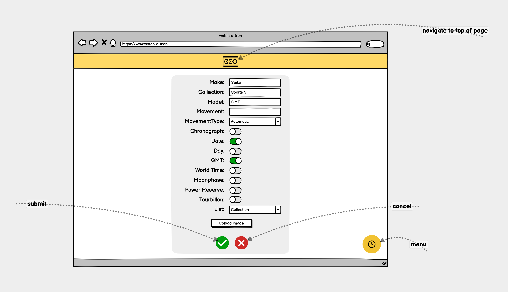 |  |  |  |  |  |

## Features

### Existing Features

- ### Title and Logo
    The title and logo remain in the same place throughout the site. Curious users may notice it is not always the same...

    

- ### User Accounts

    #### Individual Accounts

    - When you first navigate to the Watch-O-Tron you are required to log in or create an account. This is because every user needs their own account to use the site. This keeps their information private and stops anyone without authorisation editing their data. When logged in your username is displayed so that you know you are logged in to the correct account. Every page also has the log out button.
    <br>

    | Sign In | Sign Up | Sign Out |
    | :---: | :---: | :---: |
    |  | 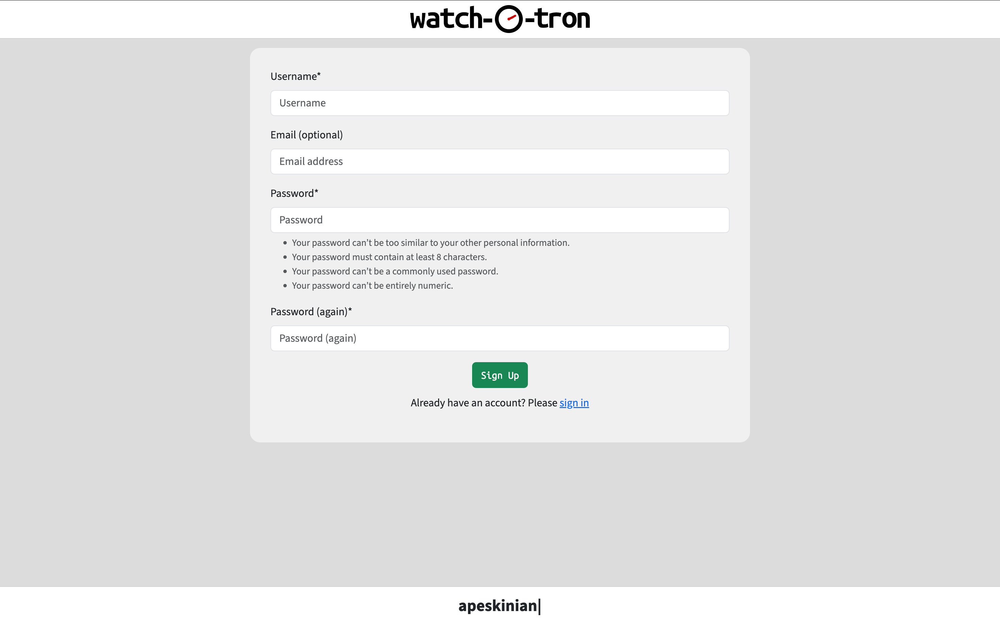 | 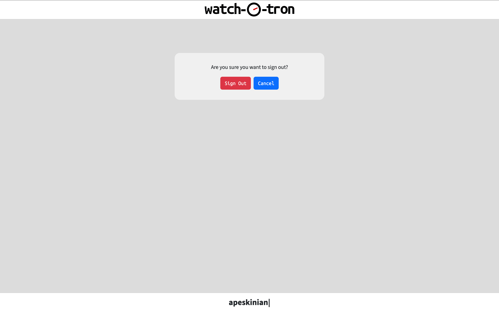 |

    | Sign Out Button Mobile | Sign Out Button Desktop |
    | :---: | :---: |
    |  |  |

    #### Different Account Levels

    - There are three levels of user each with different levels of access:
        - **User**: this is the default level with the following privileges:
            - Access their account.
            - View their watches.
            - Add a watch to any available list.
            - Edit any of their watches.
            - Delete any of their watches.
        - **Staff Member**: this is the standard level that would be given to a client user. They have all the same privileges as User with the additions:
            - Access to the staff settings page.
            - Add a new custom movement type and list.
            - Edit any custom movements or lists.
            - Delete any custom movements or lists.

            **Note:** staff members cannot edit or delete the default types of movement or list.
        - **Super User**: this is the highest level and only for site administrators. In addition to User and Staff Member privileges they can:
            - Access the Django Admin Panel.
            - Create any type of user.
            - Edit any user.
            - Delete any user.
            - Create new default movements or lists.
            - Edit **any** movement or list.
            - Delet **any** movement or list.
    
    If you are a staff member or super user (admin) it will be displayed next your username and you will be presented with extra buttons to access the appropriate settings given to you.

    |  | User | Staff Member | Super User |
    | :---: | :---: | :---: | :---: |
    | **Mobile** |  |  |  |
    | **Desktop** |  |  | 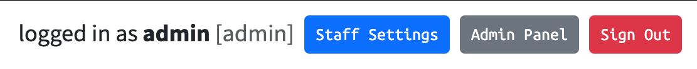 |

- ### Site Navigation

    **Note:** tapping/clicking on the main logo will bring you back to the home page on both mobile and desktop versions.

    #### Mobile
    Most navigation of the site on a mobile device is done through the collapsing navbar at the bottom of the screen, from here you can:
    - View all the lists you currently have watched stored in.
    - Add a new watch.
    - Logout.
    - Access any user level specific pages.

    If the current list of watches you are viewing contains more than 8 watches you will get a pagination navigation bar appear just above the menu.

    To edit any watch you can tap anywhere on the watch to reveal the edit or delete buttons from which you can perform each action from. If the watch is in the wish list you will also get a 'purchase' option button.

    | Mobile Navbar | Mobile Navbar Expanded | Mobile Pagination | Watch Edit Hidden | Watch Edit Revealed |
    | :---: | :---: | :---: | :---: | :---: |
    |  | 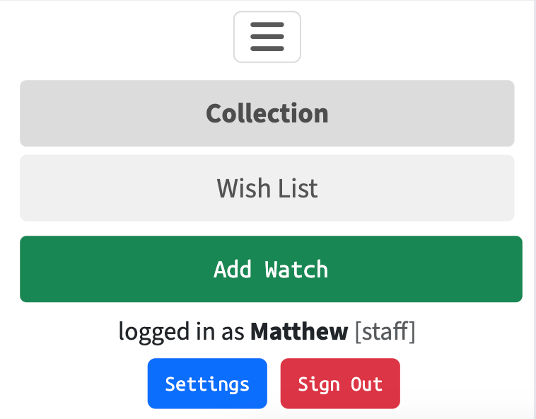 |  |  |  |

    #### Desktop
    The main navigation for desktop devices is located at the top of the screen, from here you can:
    - View all the lists you currently have watched stored in. Collection and Wish List are always visible, any extra custom lists are shown in the dropdown menu.
    - Logout.
    - Access any user level specific pages.

    To add a watch, the button is located at the bottom of the screen in a prominant central position. If the current list of watches you are viewing contains more than 8 watches you will get a pagination navigation bar appear just above this button.

    To edit any watch you can click anywhere on the watch to reveal the edit or delete buttons from which you can perform each action from. If the watch is in the wish list you will also get a 'purchase' option button.

    | Desktop Navbar | Desktop Navbar Expanded | Desktop Add Watch | Desktop Pagination | Watch Edit Hidden | Watch Edit Revealed |
    | :---: | :---: | :---: | :---: | :---: | :---: |
    |  |  |  |  |  |  |

- ### Viewing Watches

- ### Adding Watches

- ### Purchased Watches

- ### Editing Watches

- ### Deleting Watches

- ### Staff Member Access Privileges

- ### Super User Access Privileges

- ### Communication to User
    #### Messaging
    #### Working Spinner

- ### Tooltips

- ### Easter Eggs

### Future Features

- USER FORUM
    - I would like to add a forum feature where users can communicate with each other, ask questions and post interesting things about their watches.
- DIRECT MESSAGING
    - An addition to the forum feature would be the implementation of a direct messaging system for when privacy is required for conversations.
- USER ACCOUNT DELETION
    - It would be good for a user to be able to delete their account which would in turn delete all info about them and their watches from the site.

## Tools & Technologies Used

> [!NOTE]  
> I have listed both Materialize and Bootstrap as CSS frameworks used. This is because my initial design used materialize as I wanted to use features such as card reveals and floating action buttons (seen in the wireframes). However it soon became apparent that using materialize was causing more issues as I got further into development. I therefore made the decision to switch over to Bootstrap for my CSS framework.

- [](https://tim.2bn.dev/markdown-builder) used to generate README and TESTING templates.
- [](https://git-scm.com) used for version control. (`git add`, `git commit`, `git push`)
- [](https://github.com) used for secure online code storage.
- [](https://gitpod.io) used as a cloud-based IDE for development.
- [](https://en.wikipedia.org/wiki/HTML) used for the main site content.
- [](https://en.wikipedia.org/wiki/CSS) used for the main site design and layout.
- [](https://www.javascript.com) used for user interaction on the site.
- [](https://www.python.org) used as the back-end programming language.
- [](https://www.heroku.com) used for hosting the deployed back-end site.
- [](https://getbootstrap.com) used as the front-end CSS framework for modern responsiveness and pre-built components.
- [](https://materializecss.com) used as the front-end CSS framework for modern responsiveness and pre-built components.
- [](https://www.djangoproject.com) used as the Python framework for the site.
- [](https://dbs.ci-dbs.net) used as the Postgres database from Code Institute.
- [](https://cloudinary.com) used for online static file storage.
- [](https://whitenoise.readthedocs.io) used for serving static files with Heroku.
- [](https://balsamiq.com/wireframes) used for creating wireframes.
- [](https://www.lucidchart.com/pages) used for creating an erd for the database models.
- [](https://www.mermaidchart.com/) used for creating a flowchart for the apps logic.
- [](https://fontawesome.com) used for the icons.
- [](https://chat.openai.com) used to help debug, troubleshoot, and explain things.

## App Logic

To follow best practice, a flowchart was created for the app's logic. This was mapped out before coding began using a free version of [Mermaid](https://www.mermaidchart.com/)

Below is the mermaid flowchart of the showing the main processes of Wath-O-Tron:


Source in live editor: [Watch-O-Tron Mermaid flowchart](https://mermaid.live/edit#pako:eNq1WFtv2zYU_iuECgwpYCcWdbEkFM2QZBn2EGxYMxTYvAfGoi2tMulRVFwvyH_fIUVakis7juM6eaDI73znfij7yZnylDqJMxwOJ2zK2SyfJxOGkMzogiYopTNSFXLC9Pms4KtpRoRE9zcKhBBz_5o4KyKn2ZAPpeAM5SyXOSnykpYT5280HH5EDAMoL1FVUoEKPp_TFGCXcGxIMMAQ4zXYAzCAcnYh6DwvJciUU0Epa_CeoW2Lr2lZ7_ogrzVlfEGXZE4bOb9GuO4ZYMpVDmajx5yuSjTlRUGnMufsYpWXGZgvQew9-gHQI4UmaYoYXSHtK3qopORsg1Aqy4yvWjQI_rUXKggKE57VfvFKMxuLAtgUVIqcPtK2dEokOf_wID5C2GqVrUO6WMq1Ch_6AI7_W1Gx1gIPpKS1hyHQ2p3G_XFbmXWzR9Xm6ABF1o92BiMTjpzNvzFeKTqbEpHWgX_fWBcrqQqKAxRLjlTAtXBdRU1-XVVNTSpmXCwaEndkQXbDVcIm10C78U3DxjtQrWBrXGAj2HbT9dp-Gt7d_o07XsRWs6llXxdJrIpECsLKGRRw7WDHHFtyWBdlSgsq6SZM9Ykubprmstk3uqKWKhx8C9P7YR-xNdbvhiPoJkYVc0ZMn_9TQZD7mt3t1Erc2d1wbRITGm77rGp4-OuKUaEiPfxUVHO9uCNfqF5cd0pteAfjrTCrRxhpDGbXellDf1nAdKiFMhhdfC7IMrvUGzdEUrta14uf7-7rxWcuivTScHJWr35bCfQ7Bccfjdw9r8RDXhQWcN0aDQJ9NuVyaar7DxWynC0ruV2_2GyoptLzWSyIqQQLUXlF5kz1Ta61EJaiagntSnf0bC2nSyClkuRFua07NnPW26kbezZte1VtYBdN89gj07HY363EP0yJv1uJqydYM_x0Z3W8DhsoIJeCziB5WpOxD9ubrg5Zd-5g3M6BApQvJwAHO1SN96oyLYF3VwSOtiMRbZ-8YNn4ZXd6vDk4xrG9o3XJN-8Jtu290Q4A7tY8YVNaaMtAbSWYTbuaZFEnNd3zjpvtIysU_viEyows1SvQw_OE1X_qqJTrggIHLAT_QoerPJVZ4i-_DsxGSkBQCLJOUDBQmU3e3d7extf-AMY4F8m7kf4YuH3skGPUkTtI0x46r6GDzxbyEPYund9Ht19-n3Vw93YDY9lvwm3r8BHsI3RaPv-0uYELbisfNf1NoB9MZF4R6g57cFpjx310rymkoEMX9bt-rLMx6karZsNxiLfZjsm77UnDtycxx7B7pw0F3Nw9Vd-fKXwAH1zSfbE1Rfpmdve0PQo30Y5oHkzf5QvRoU15TO6D03aVO0Z9F82rDDQBu7q6-en2qsseGWtHo-so8E4cC-x9V3a_t4qNrjdXMe6vuqMHRpd9_D3nD7wWvhiZN7DbaVTX05v5vFEf36sy5wycBYX35jx1EudJscP3bvWT18RJkPr-W__s5UzYM0BJJfmnNZs6iRQVHTiCV_PMSWakKOGpfim-yQl8f1xYyJIwJ3lyvjqJ63rnIy_EUTAOYxx5OBg4aycJRufuOIhwFMZj2I2fB85_nIP86Dx2MfZGQeBiHwPA12x_6kNF_vw_WasukQ)

## Database Design

Entity Relationship Diagrams (ERD) help to visualize database architecture before creating models.
Understanding the relationships between different tables can save time later in the project.

```python
class WatchList(models.Model):
    class Meta:
        ordering = ['list_order', 'friendly_name']

    list_name = models.CharField(
        max_length=100, unique=True, blank=True, null=True
    )
    friendly_name = models.CharField(
        max_length=100, unique=True, verbose_name=' name'
    )
    list_order = models.IntegerField(default=1000)

    def __str__(self):
        return self.friendly_name

    def save(self, *args, **kwargs):
        # creating url friendly name from user entered friendly_name
        self.list_name = slugify(self.friendly_name)
        super().save(*args, **kwargs)


class WatchMovement(models.Model):
    movement_name = models.CharField(
        max_length=100, unique=True, verbose_name=' name'
    )

    def __str__(self):
        return self.movement_name


class Watch(models.Model):
    class Meta:
        verbose_name_plural = 'Watches'

    # general watch details
    owner = models.ForeignKey(
        User, on_delete=models.CASCADE, related_name='watch_owner'
    )
    list_name = models.ForeignKey(
        WatchList, on_delete=models.CASCADE, related_name='watch_list'
    )
    movement_type = models.ForeignKey(
        WatchMovement, on_delete=models.CASCADE, related_name='watch_movement'
    )
    make = models.CharField(max_length=100, null=False, blank=False)
    collection = models.CharField(max_length=100, blank=True)
    model = models.CharField(max_length=100, blank=True)
    movement_model = models.CharField(max_length=50, blank=True)
    image = CloudinaryField(
        'image', default='placeholder', asset_folder='/wot_watches/'
    )
    # complications
    complication_chronograph = models.BooleanField(default=False)
    complication_date = models.BooleanField(default=False)
    complication_day = models.BooleanField(default=False)
    complication_gmt = models.BooleanField(default=False)
    complication_world_timer = models.BooleanField(default=False)
    complication_moonphase = models.BooleanField(default=False)
    complication_power_reserve = models.BooleanField(default=False)
    complication_tourbillon = models.BooleanField(default=False)

    def __str__(self):
        return f'{self.make} {self.collection} {self.model}'

    def delete(self, *args, **kwargs):
        # checking to see if the image is a placeholder and delete image if not
        if self.image != 'placeholder':
            public_id = self.image.public_id
            cloudinary.uploader.destroy(public_id)
        # proceed with normal deletion
        super().delete(*args, **kwargs)
```

I created an ERD to help code the models for the database. This was done using a free version of [Lucid chart](https://www.lucidchart.com/pages)


I have also used `pygraphviz` and `django-extensions` to auto-generate an ERD.

The steps taken were as follows:
- In the terminal: `sudo apt update`
- then: `sudo apt-get install python3-dev graphviz libgraphviz-dev pkg-config`
- then type `Y` to proceed
- then: `pip3 install django-extensions pygraphviz`
- in my `settings.py` file, I added the following to my `INSTALLED_APPS`:
```python
INSTALLED_APPS = [
    ...
    'django_extensions',
    ...
]
```
- back in the terminal: `python3 manage.py graph_models -a -o erd.png`
- dragged the new `erd.png` file into my `documentation/` folder
- removed `'django_extensions',` from my `INSTALLED_APPS`
- finally, in the terminal: `pip3 uninstall django-extensions pygraphviz -y`
git

source: [medium.com](https://medium.com/@yathomasi1/1-using-django-extensions-to-visualize-the-database-diagram-in-django-application-c5fa7e710e16)


## Agile Development Process

### GitHub Projects

[GitHub Projects](https://github.com/apeskinian/p4_watch-o-tron/projects) served as an Agile tool for this project.
It isn't a specialized tool, but with the right tags and project creation/issue assignments, it can be made to work.

Through it, user stories, issues, and milestone tasks were planned, then tracked on a weekly basis using the basic Kanban board.

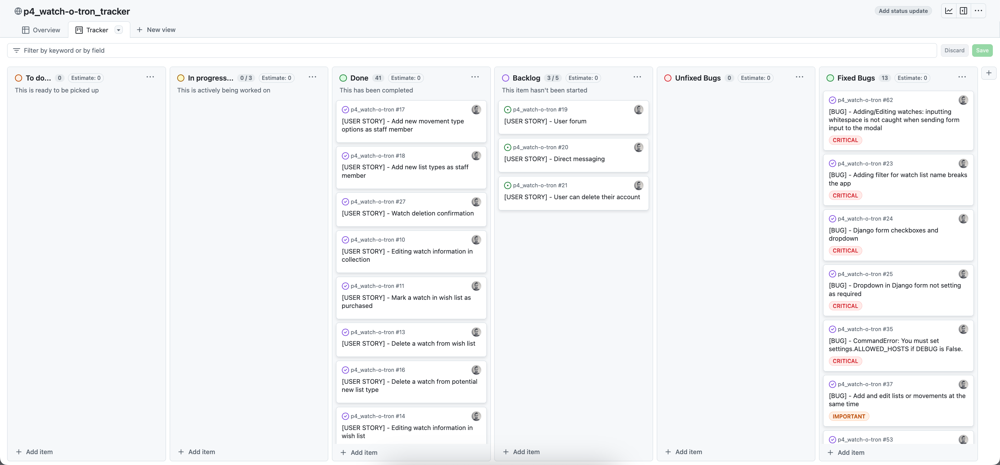

I also created an overview page where I could easily see at a glance the current progress in development. This allowed me to track start and finish dates along with adding prioritisation for bugs.

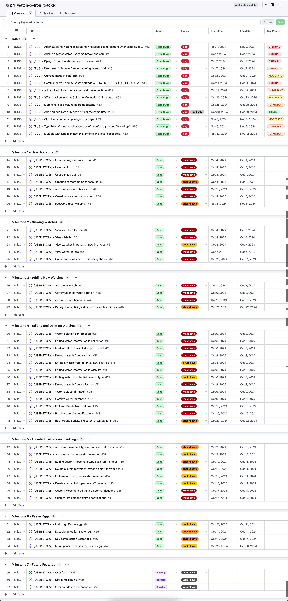

### GitHub Issues

[GitHub Issues](https://github.com/apeskinian/p4_watch-o-tron/issues) served as an another Agile tool.
There, I used my own **User Story Template** to manage user stories.

It also helped with milestone iterations on a weekly basis.

- [Open Issues](https://github.com/apeskinian/p4_watch-o-tron/issues) [](https://github.com/apeskinian/p4_watch-o-tron/issues)

    

- [Closed Issues](https://github.com/apeskinian/p4_watch-o-tron/issues?q=is%3Aissue+is%3Aclosed) [](https://github.com/apeskinian/p4_watch-o-tron/issues?q=is%3Aissue+is%3Aclosed)

    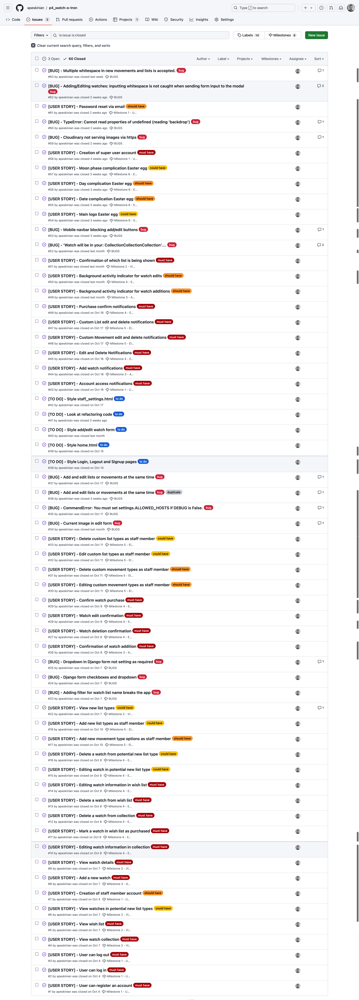

### MoSCoW Prioritization

I've decomposed my Epics into stories prior to prioritizing and implementing them.
Using this approach, I was able to apply the MoSCow prioritization and labels to my user stories within the Issues tab.

- **Must Have**: guaranteed to be delivered (*max 60% of stories*)
- **Should Have**: adds significant value, but not vital (*the rest ~20% of stories*)
- **Could Have**: has small impact if left out (*20% of stories*)
- **Won't Have**: not a priority for this iteration

The GitHub projects helped keep track of this with the creation of a graph.

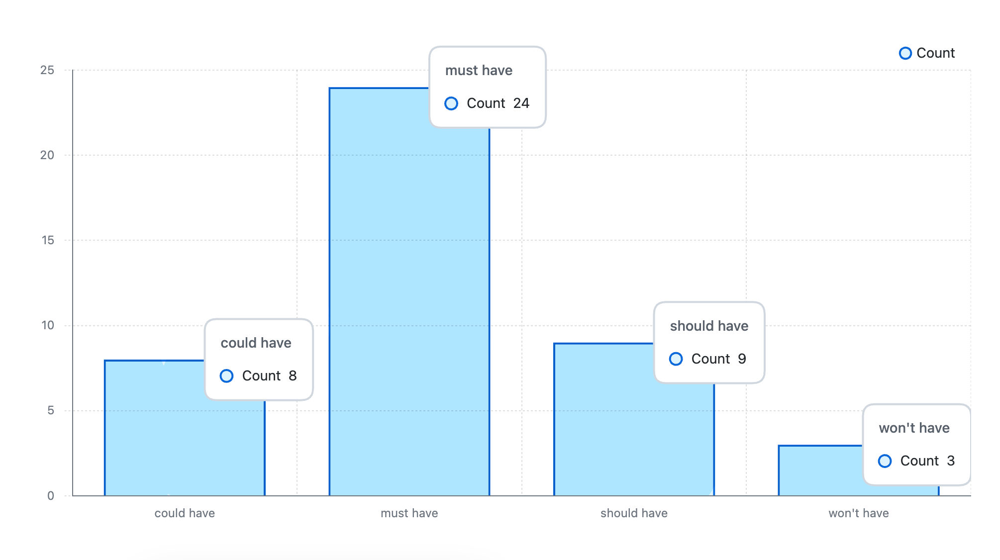

## Testing

> [!NOTE]  
> For all testing, please refer to the [TESTING.md](TESTING.md) file.

## Deployment

The live deployed application can be found deployed on [Heroku](https://apeskinian-watch-o-tron-f4512ce56f33.herokuapp.com).

### PostgreSQL Database

This project uses a [Code Institute PostgreSQL Database](https://dbs.ci-dbs.net).

To obtain my own Postgres Database from Code Institute, I followed these steps:

- Signed-in to the CI LMS using my email address.
- An email was sent to me with my new Postgres Database.

> [!CAUTION]  
> - PostgreSQL databases by Code Institute are only available to CI Students.
> - You must acquire your own PostgreSQL database through some other method
> if you plan to clone/fork this repository.
> - Code Institute students are allowed a maximum of 8 databases.
> - Databases are subject to deletion after 18 months.

### Cloudinary API

This project uses the [Cloudinary API](https://cloudinary.com) to store media assets online, due to the fact that Heroku doesn't persist this type of data.

To obtain your own Cloudinary API key, create an account and log in.

- For *Primary interest*, you can choose *Programmable Media for image and video API*.
- Optional: *edit your assigned cloud name to something more memorable*.
- On your Cloudinary Dashboard, you can copy your **API Environment Variable**.
- Be sure to remove the `CLOUDINARY_URL=` as part of the API **value**; this is the **key**.

### Heroku Deployment

This project uses [Heroku](https://www.heroku.com), a platform as a service (PaaS) that enables developers to build, run, and operate applications entirely in the cloud.

Deployment steps are as follows, after account setup:

- Select **New** in the top-right corner of your Heroku Dashboard, and select **Create new app** from the dropdown menu.
- Your app name must be unique, and then choose a region closest to you (EU or USA), and finally, select **Create App**.
- From the new app **Settings**, click **Reveal Config Vars**, and set your environment variables.

> [!IMPORTANT]  
> This is a sample only; you would replace the values with your own if cloning/forking my repository.

| Key | Value |
| --- | --- |
| `DATABASE_URL` | user's own value |
| `SECRET_KEY` | user's own value |
| `CLOUDINARY_URL` | user's own value |
| `CLOUDINARY_NAME` | user's own value |
| `CLOUDINARY_API` | user's own value |
| `CLOUDINARY_SECRET` | user's own value |
| `DISABLE_COLLECTSTATIC` | 1 (*this is temporary, and can be removed for the final deployment*) |

Heroku needs three additional files in order to deploy properly.

- requirements.txt
- Procfile
- runtime.txt

You can install this project's **requirements** (where applicable) using:

- `pip3 install -r requirements.txt`

If you have your own packages that have been installed, then the requirements file needs updated using:

- `pip3 freeze --local > requirements.txt`

The **Procfile** can be created with the following command:

- `echo web: gunicorn app_name.wsgi > Procfile`
- *replace **app_name** with the name of your primary Django app name; the folder where settings.py is located*

The **runtime.txt** file needs to know which Python version you're using:
1. type: `python3 --version` in the terminal.
2. in the **runtime.txt** file, add your Python version:
	- `python-3.9.19`

For Heroku deployment, follow these steps to connect your own GitHub repository to the newly created app:

Either:

- Select **Automatic Deployment** from the Heroku app.

Or:

- In the Terminal/CLI, connect to Heroku using this command: `heroku login -i`
- Set the remote for Heroku: `heroku git:remote -a app_name` (replace *app_name* with your app name)
- After performing the standard Git `add`, `commit`, and `push` to GitHub, you can now type:
	- `git push heroku main`

The project should now be connected and deployed to Heroku!

### Local Deployment

This project can be cloned or forked in order to make a local copy on your own system.

For either method, you will need to install any applicable packages found within the *requirements.txt* file.

- `pip3 install -r requirements.txt`.

You will need to create a new file called `env.py` at the root-level,
and include the same environment variables listed above from the Heroku deployment steps.

> [!IMPORTANT]  
> This is a sample only; you would replace the values with your own if cloning/forking my repository.

Sample `env.py` file:

```python
import os

os.environ.setdefault("DATABASE_URL", "user's own value")
os.environ.setdefault("SECRET_KEY", "user's own value")
os.environ.setdefault("CLOUDINARY_URL", "user's own value")
os.environ.setdefault("CLOUDINARY_NAME", "user's own value")
os.environ.setdefault("CLOUDINARY_API", "user's own value")
os.environ.setdefault("CLOUDINARY_SECRET", "user's own value")

# local environment only (do not include these in production/deployment!)
os.environ.setdefault("DEVELOPMENT", "True")
```

Once the project is cloned or forked, in order to run it locally, you'll need to follow these steps:

- Start the Django app: `python3 manage.py runserver`
- Stop the app once it's loaded: `CTRL+C` or `⌘+C` (Mac)
- Make any necessary migrations: `python3 manage.py makemigrations`
- Migrate the data to the database: `python3 manage.py migrate`
- Create a superuser: `python3 manage.py createsuperuser`
- Load fixtures (if applicable): `python3 manage.py loaddata file-name.json` (repeat for each file)
- Everything should be ready now, so run the Django app again: `python3 manage.py runserver`

#### Cloning

You can clone the repository by following these steps:

1. Go to the [GitHub repository](https://github.com/apeskinian/p4_watch-o-tron) 
2. Locate the Code button above the list of files and click it 
3. Select if you prefer to clone using HTTPS, SSH, or GitHub CLI and click the copy button to copy the URL to your clipboard
4. Open Git Bash or Terminal
5. Change the current working directory to the one where you want the cloned directory
6. In your IDE Terminal, type the following command to clone my repository:
	- `git clone https://github.com/apeskinian/p4_watch-o-tron.git`
7. Press Enter to create your local clone.

Alternatively, if using Gitpod, you can click below to create your own workspace using this repository.

[](https://gitpod.io/#https://github.com/apeskinian/p4_watch-o-tron)

Please note that in order to directly open the project in Gitpod, you need to have the browser extension installed.
A tutorial on how to do that can be found [here](https://www.gitpod.io/docs/configure/user-settings/browser-extension).

#### Forking

By forking the GitHub Repository, we make a copy of the original repository on our GitHub account to view and/or make changes without affecting the original owner's repository.
You can fork this repository by using the following steps:

1. Log in to GitHub and locate the [GitHub Repository](https://github.com/apeskinian/p4_watch-o-tron)
2. At the top of the Repository (not top of page) just above the "Settings" Button on the menu, locate the "Fork" Button.
3. Once clicked, you should now have a copy of the original repository in your own GitHub account!

### Local VS Deployment

There are no differences between the local and deployed version of the site.

## Credits

### Content

| Source | Location | Notes |
| --- | --- | --- |
| [Markdown Builder](https://tim.2bn.dev/markdown-builder) | README and TESTING | tool to help generate the Markdown files |
| [Bootrap Documentation](https://getbootstrap.com/docs/5.3/getting-started/introduction/) | entire site | using bootstrap |
| [Medium - How to Style Your Django Forms](https://medium.com/swlh/how-to-style-your-django-forms-7e8463aae4fa) | manage watch forms | help on manually styling Django forms |
| [Stack Overflow](https://stackoverflow.com/questions/52803129/how-to-add-django-template-variable-in-img-src) | entire site | adding django template variable to  |
| [Codepen](https://codepen.io/dope/pen/KJYMZz) | clock in main logo | base code for working clock |
| [PyPI](https://pypi.org/project/ephem/) | watch object moonphase icons | package that provides current moonphase angle |
| [Cloudinary](https://cloudinary.com/) | entire site | hosting user uploaded images |
| [WhiteNoise](http://whitenoise.evans.io) | entire site | hosting static files on Heroku temporarily |

### Media

| Source | Location | Type | Notes |
| --- | --- | --- | --- |
| [Favicon Generator](https://favicon.io/favicon-converter/) | entire site | favicon | icon generated from my own png |
| [Vecteezy](https://www.vecteezy.com/vector-art/25751307-wrist-watch-vector-silhouette-illustration) | watch objects | image | placeholder image for watches |
| [Font Awesome](https://fontawesome.com/icons/stopwatch?f=classic&s=solid) | watch objects | image | chronograph complication icon |
| [Font Awesome](https://fontawesome.com/icons/plane?f=classic&s=solid) | watch objects | image | gmt complication icon |
| [Font Awesome](https://fontawesome.com/icons/earth-americas?f=classic&s=solid) | watch objects | image | world timer complication icon |
| [Clop Image Optimization](https://lowtechguys.com/clop/) | entire site | software | used to optimise all media |
| [Cleanshot X](https://cleanshot.com/) | README and TESTING | software | used for screenshots and video capture |

#### Custom Media

The following elements were created by myself.

| Element | Location | Notes |
| --- | --- | --- |
| Favicon | favicon for all pages | I created the png that was uploaded to [Favicon Generator](https://favicon.io/favicon-converter/) |
| Day Complication icon | watch objects | 31 variants that change dynamically based on the current day |
| Date Complication icon | watch objects | 7 variants that change dynamically based on the current date |
| Moonphase Complication icon | watch objects | 8 variants that change dynamically based on the current moonphase |
| Power Reserve Complication icon | watch objects |  |
| Tourbillon Complication icon | watch objects |  |


### Acknowledgements

- I would like to thank my Code Institute mentor, [Tim Nelson](https://github.com/TravelTimN) for his support throughout the development of this project.
- I would like to thank the [Code Institute](https://codeinstitute.net) tutor team for their assistance with troubleshooting and debugging some project issues.
- I would like to thank the [Code Institute Slack community](https://code-institute-room.slack.com) for the moral support; it kept me going during periods of self doubt and imposter syndrome.
- I would like to thank my daughter Niamh, my sisters Laura & Natalie and my whole family for believing in me, and supporting me while making this transition into software development.
