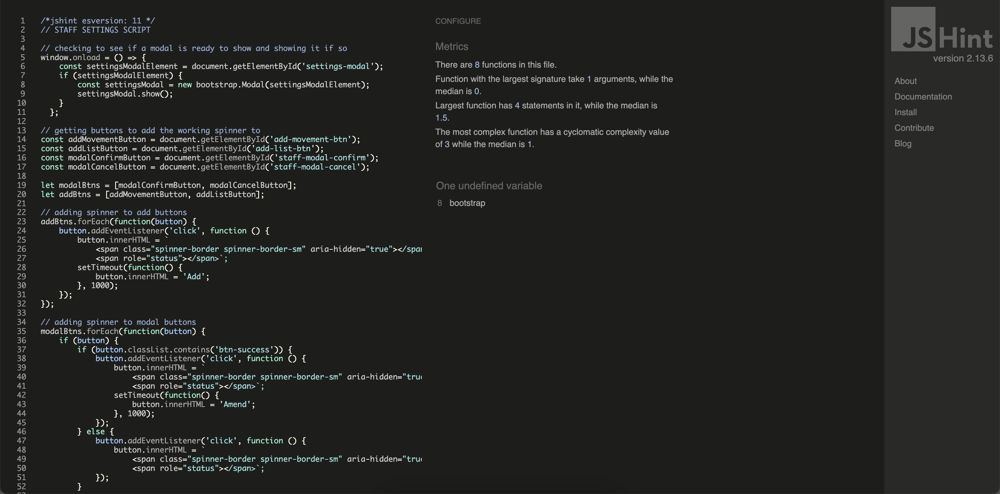
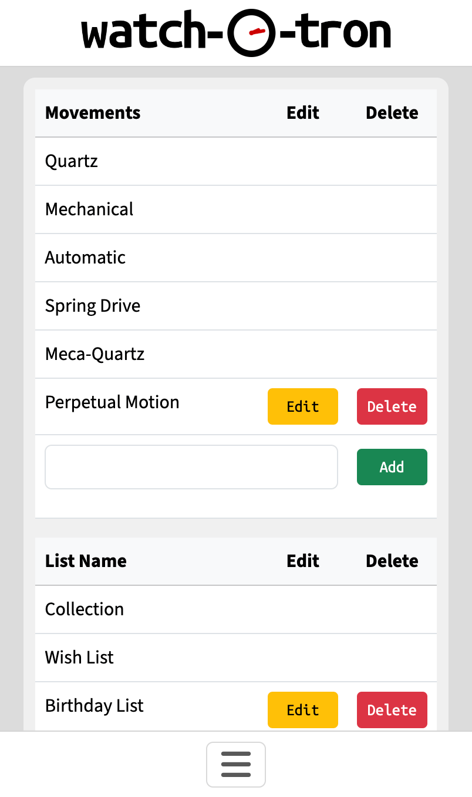
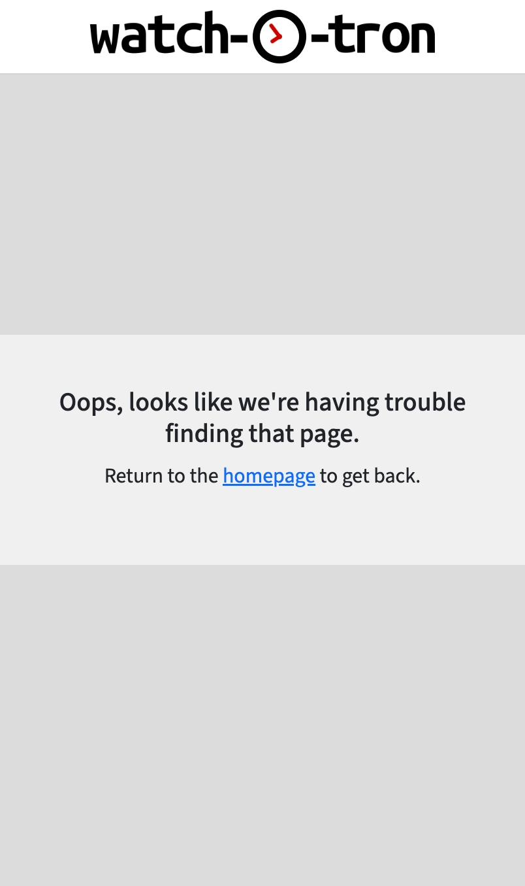
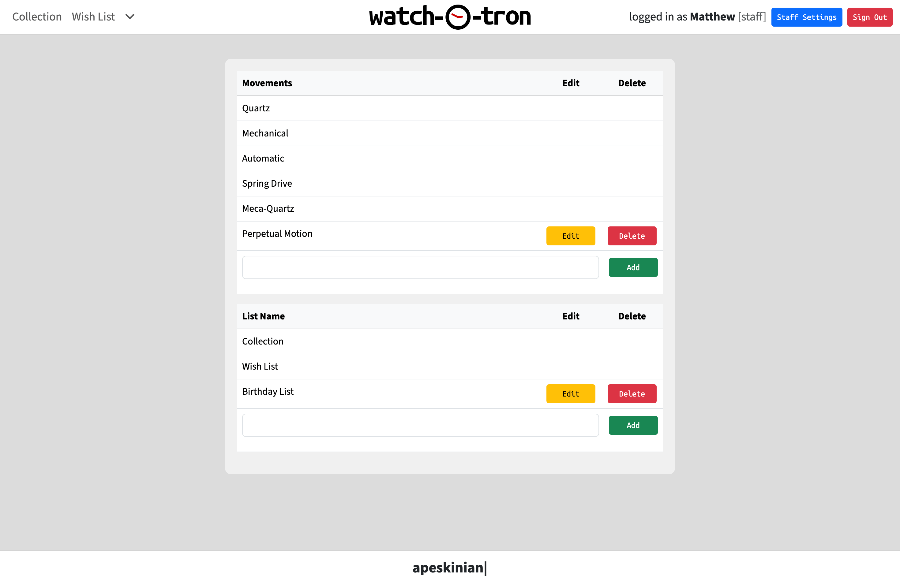
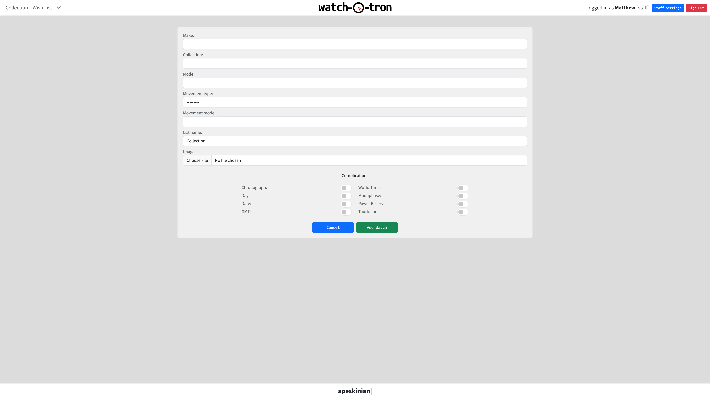
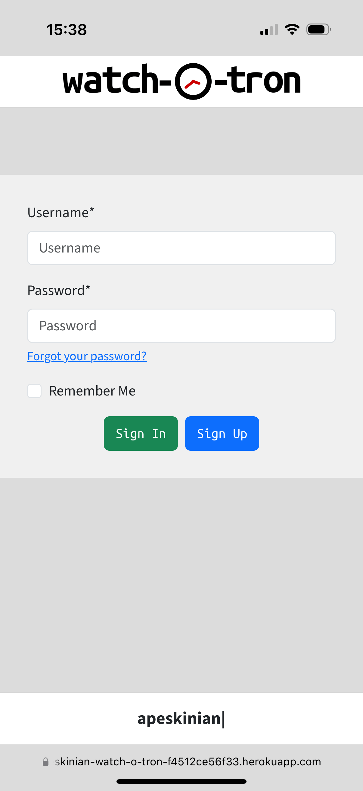

# Testing

> [!NOTE]  
> Return back to the [README.md](README.md) file.

## Code Validation

### HTML

I have used the recommended [HTML W3C Validator](https://validator.w3.org) to validate all of my HTML files.

> [!NOTE]  
> The main template and also other partial html files listed below were tested as part of the main site files as they include them.
> - base.html
> - clockface.html
> - messages.html
> - pagination.html
> - standard_nav.html

| Directory | File | Screenshot | Notes |
| --- | --- | --- | --- |
| templates | 404.html |  | no errors or warnings |
| templates/account | login.html |  | no errors or warnings |
| templates/account | logout.html |  | no errors or warnings |
| templates/account | signup.html |  | no errors or warnings |
| watches/templates/watches | index.html |  | |
| watches/templates/watches | manage_watch.html |  | no errors or warnings |
| watches/templates/watches | staff_settings.html |  | no errors or warnings |

### CSS

I have used the recommended [CSS Jigsaw Validator](https://jigsaw.w3.org/css-validator) to validate all of my CSS files.

| Directory | File | Screenshot | Notes |
| --- | --- | --- | --- |
| static | clockface.css |  | no errors found |
| static | style.css |  | no errors found |

### JavaScript

I have used the recommended [JShint Validator](https://jshint.com) to validate all of my JS files.

| Directory | File | Screenshot | Notes |
| --- | --- | --- | --- |
| static | base_script.js |  | bootstrap varable picked up as undefined and bootstrap variable tooltips marked as unused |
| static | edit_watch_script.js |  | bootstrap varable picked up as undefined |
| static | staff_settings_script.js |  | bootstrap varable picked up as undefined |
| static | watch_script.js |  | bootstrap varable picked up as undefined |

### Python

I have used the recommended [PEP8 CI Python Linter](https://pep8ci.herokuapp.com) to validate all of my Python files.

| Directory | File | CI URL | Screenshot | Notes |
| --- | --- | --- | --- | --- |
|  | manage.py | [PEP8 CI](https://pep8ci.herokuapp.com/https://raw.githubusercontent.com/apeskinian/p4_watch-o-tron/main/manage.py) |  | all clear, no errors found |
| watches | admin.py | [PEP8 CI](https://pep8ci.herokuapp.com/https://raw.githubusercontent.com/apeskinian/p4_watch-o-tron/main/watches/admin.py) |  | all clear, no errors found |
| watches | forms.py | [PEP8 CI](https://pep8ci.herokuapp.com/https://raw.githubusercontent.com/apeskinian/p4_watch-o-tron/main/watches/forms.py) |  | all clear, no errors found |
| watches | models.py | [PEP8 CI](https://pep8ci.herokuapp.com/https://raw.githubusercontent.com/apeskinian/p4_watch-o-tron/main/watches/models.py) |  | all clear, no errors found |
| watches | urls.py | [PEP8 CI](https://pep8ci.herokuapp.com/https://raw.githubusercontent.com/apeskinian/p4_watch-o-tron/main/watches/urls.py) |  | all clear, no errors found |
| watches | moons.py | [PEP8 CI](https://pep8ci.herokuapp.com/https://raw.githubusercontent.com/apeskinian/p4_watch-o-tron/main/watches/utils/moons.py) |  | all clear, no errors found |
| watches | views.py | [PEP8 CI](https://pep8ci.herokuapp.com/https://raw.githubusercontent.com/apeskinian/p4_watch-o-tron/main/watches/views.py) |  | all clear, no errors found |
| watchotron | settings.py | [PEP8 CI](https://pep8ci.herokuapp.com/https://raw.githubusercontent.com/apeskinian/p4_watch-o-tron/main/watchotron/settings.py) |  | added # noqa to lines 141, 144, 147 and 150 to ignore Django's long lines then all clear, no errors found |
| watchotron | urls.py | [PEP8 CI](https://pep8ci.herokuapp.com/https://raw.githubusercontent.com/apeskinian/p4_watch-o-tron/main/watchotron/urls.py) |  | all clear, no errors found |

## Browser Compatibility

I've tested my deployed project on multiple browsers to check for compatibility issues.

| Browser | Login | Logout | Signup | Home | Add/Edit Watch | Staff Settings | 404 | Notes |
| --- | --- | --- | --- | --- | --- | --- | --- | --- |
| Chrome |  |  |  |  |  |  |  | works as expected |
| Firefox |  |  |  |  |  |  |  | works as expected |
| Edge |  |  |  |  |  |  |  | works as expected |
| Safari |  |  |  |  |  |  |  | works as expected |

## Responsiveness

I've tested my deployed project on multiple devices to check for responsiveness issues.

| Device | Login | Logout | Signup | Home | Home with expanded menu | Add/Edit Watch | Staff Settings | 404 | Notes |
| --- | --- | --- | --- | --- | --- | --- | --- | --- | --- |
| Mobile (devtools) |  |  |  |  |  |  |  |  | tooltips only show on tap with mobile device |
| Tablet (devtools) |  |  |  |  |  |  |  |  | tooltips only show on tap with tablet device |
| Desktop (devtools) |  |  |  |  |  |  |  |  | works as expected |
| 4k Screen (devtools) |  |  |  |  |  |  |  |  | works as expected things starting to look a little small |
| iPhone 16 Pro |  |  |  |  |  |  |  |  | works as expected |


## Lighthouse Audit

🛑🛑🛑🛑🛑🛑🛑🛑🛑🛑-START OF NOTES (to be deleted)

Use this space to discuss testing the live/deployed site's Lighthouse Audit reports.
Avoid testing the local version (especially if developing in Gitpod), as this can have knock-on effects of performance.

If you don't have Lighthouse in your Developer Tools,
it can be added as an [extension](https://chrome.google.com/webstore/detail/lighthouse/blipmdconlkpinefehnmjammfjpmpbjk).

Don't just test the home page (unless it's a single-page application).
Make sure to test the Lighthouse Audit results for all of your pages.

**IMPORTANT**: You must provide screenshots of the results, to "prove" that you've actually tested them.

Sample Lighthouse testing documentation:

🛑🛑🛑🛑🛑🛑🛑🛑🛑🛑-END OF NOTES (to be deleted)

I've tested my deployed project using the Lighthouse Audit tool to check for any major issues.

| Page | Mobile | Desktop | Notes |
| --- | --- | --- | --- |
| Home |  |  | Some minor warnings |
| About |  |  | Some minor warnings |
| Gallery |  |  | Slow response time due to large images |
| x | x | x | repeat for any other tested pages/sizes |

## Defensive Programming

🛑🛑🛑🛑🛑🛑🛑🛑🛑🛑-START OF NOTES (to be deleted)

Defensive programming (defensive design) is extremely important!

When building projects that accept user inputs or forms, you should always test the level of security for each.
Examples of this could include (not limited to):

Forms:
- Users cannot submit an empty form
- Users must enter valid email addresses

PP3 (Python-only):
- Users must enter a valid letter/word/string when prompted
- Users must choose from a specific list only

MS3 (Flask) | MS4/PP4/PP5 (Django):
- Users cannot brute-force a URL to navigate to a restricted page
- Users cannot perform CRUD functionality while logged-out
- User-A should not be able to manipulate data belonging to User-B, or vice versa
- Non-Authenticated users should not be able to access pages that require authentication
- Standard users should not be able to access pages intended for superusers

You'll want to test all functionality on your application, whether it's a standard form,
or uses CRUD functionality for data manipulation on a database.
Make sure to include the `required` attribute on any form-fields that should be mandatory.
Try to access various pages on your site as different user types (User-A, User-B, guest user, admin, superuser).

You should include any manual tests performed, and the expected results/outcome.

Testing should be replicable.
Ideally, tests cases should focus on each individual section of every page on the website.
Each test case should be specific, objective, and step-wise replicable.

Instead of adding a general overview saying that everything works fine,
consider documenting tests on each element of the page
(ie. button clicks, input box validation, navigation links, etc.) by testing them in their happy flow,
and also the bad/exception flow, mentioning the expected and observed results,
and drawing a parallel between them where applicable.

Consider using the following format for manual test cases:

Expected Outcome / Test Performed / Result Received / Fixes Implemented

- **Expected**: "Feature is expected to do X when the user does Y."
- **Testing**: "Tested the feature by doing Y."
- (either) **Result**: "The feature behaved as expected, and it did Y."
- (or) **Result**: "The feature did not respond to A, B, or C."
- **Fix**: "I did Z to the code because something was missing."

Use the table below as a basic start, and expand on it using the logic above.

🛑🛑🛑🛑🛑🛑🛑🛑🛑🛑-END OF NOTES (to be deleted)

Defensive programming was manually tested with the below user acceptance testing:

| Page | Expectation | Test | Result | Fix | Screenshot |
| --- | --- | --- | --- | --- | --- |
| Home | | | | | |
| | Feature is expected to do X when the user does Y | Tested the feature by doing Y | The feature behaved as expected, and it did Y | Test concluded and passed |  |
| | Feature is expected to do X when the user does Y | Tested the feature by doing Y | The feature did not respond to A, B, or C. | I did Z to the code because something was missing |  |
| About | | | | | |
| | Feature is expected to do X when the user does Y | Tested the feature by doing Y | The feature behaved as expected, and it did Y | Test concluded and passed |  |
| | Feature is expected to do X when the user does Y | Tested the feature by doing Y | The feature did not respond to A, B, or C. | I did Z to the code because something was missing |  |
| Gallery | | | | | |
| | Feature is expected to do X when the user does Y | Tested the feature by doing Y | The feature behaved as expected, and it did Y | Test concluded and passed |  |
| | Feature is expected to do X when the user does Y | Tested the feature by doing Y | The feature did not respond to A, B, or C. | I did Z to the code because something was missing |  |
| Contact | | | | | |
| | Feature is expected to do X when the user does Y | Tested the feature by doing Y | The feature behaved as expected, and it did Y | Test concluded and passed |  |
| | Feature is expected to do X when the user does Y | Tested the feature by doing Y | The feature did not respond to A, B, or C. | I did Z to the code because something was missing |  |
| repeat for all remaining pages | x | x | x | x | x |

🛑🛑🛑🛑🛑🛑🛑🛑🛑🛑-START OF NOTES (to be deleted)

Another way of performing defensive testing is a simple Pass/Fail for each test.
The assessors prefer the above method, with the full test explained, but this is also acceptable in most cases.

When in doubt, use the above method instead, and delete the table below.

🛑🛑🛑🛑🛑🛑🛑🛑🛑🛑-END OF NOTES (to be deleted)

| Page | User Action | Expected Result | Pass/Fail | Comments |
| --- | --- | --- | --- | --- |
| Home | | | | |
| | Click on Logo | Redirection to Home page | Pass | |
| | Click on Home link in navbar | Redirection to Home page | Pass | |
| Gallery | | | | |
| | Click on Gallery link in navbar | Redirection to Gallery page | Pass | |
| | Load gallery images | All images load as expected | Pass | |
| Contact | | | | |
| | Click on Contact link in navbar | Redirection to Contact page | Pass | |
| | Enter first/last name | Field will accept freeform text | Pass | |
| | Enter valid email address | Field will only accept email address format | Pass | |
| | Enter message in textarea | Field will accept freeform text | Pass | |
| | Click the Submit button | Redirects user to form-dump | Pass | User must click 'Back' button to return |
| Sign Up | | | | |
| | Click on Sign Up button | Redirection to Sign Up page | Pass | |
| | Enter valid email address | Field will only accept email address format | Pass | |
| | Enter valid password (twice) | Field will only accept password format | Pass | |
| | Click on Sign Up button | Asks user to confirm email page | Pass | Email sent to user |
| | Confirm email | Redirects user to blank Sign In page | Pass | |
| Log In | | | | |
| | Click on the Login link | Redirection to Login page | Pass | |
| | Enter valid email address | Field will only accept email address format | Pass | |
| | Enter valid password | Field will only accept password format | Pass | |
| | Click Login button | Redirects user to home page | Pass | |
| Log Out | | | | |
| | Click Logout button | Redirects user to logout page | Pass | Confirms logout first |
| | Click Confirm Logout button | Redirects user to home page | Pass | |
| Profile | | | | |
| | Click on Profile button | User will be redirected to the Profile page | Pass | |
| | Click on the Edit button | User will be redirected to the edit profile page | Pass | |
| | Click on the My Orders link | User will be redirected to the My Orders page | Pass | |
| | Brute forcing the URL to get to another user's profile | User should be given an error | Pass | Redirects user back to own profile |
| repeat for all remaining pages | x | x | x | x |

🛑🛑🛑🛑🛑🛑🛑🛑🛑🛑-START OF NOTES (to be deleted)

Repeat for all other tests, as applicable to your own site.
The aforementioned tests are just an example of a few different project scenarios.

🛑🛑🛑🛑🛑🛑🛑🛑🛑🛑-END OF NOTES (to be deleted)

## User Story Testing

🛑🛑🛑🛑🛑🛑🛑🛑🛑🛑-START OF NOTES (to be deleted)

Testing user stories is actually quite simple, once you've already got the stories defined on your README.

Most of your project's **features** should already align with the **user stories**,
so this should as simple as creating a table with the user story, matching with the re-used screenshot
from the respective feature.

🛑🛑🛑🛑🛑🛑🛑🛑🛑🛑-END OF NOTES (to be deleted)

| User Story | Screenshot |
| --- | --- |
| As a new site user, I would like to ____________, so that I can ____________. |  |
| As a new site user, I would like to ____________, so that I can ____________. |  |
| As a new site user, I would like to ____________, so that I can ____________. |  |
| As a returning site user, I would like to ____________, so that I can ____________. |  |
| As a returning site user, I would like to ____________, so that I can ____________. |  |
| As a returning site user, I would like to ____________, so that I can ____________. |  |
| As a site administrator, I should be able to ____________, so that I can ____________. |  |
| As a site administrator, I should be able to ____________, so that I can ____________. |  |
| As a site administrator, I should be able to ____________, so that I can ____________. |  |
| repeat for all remaining user stories | x |

## Automated Testing

I have conducted a series of automated tests on my application.

I fully acknowledge and understand that, in a real-world scenario, an extensive set of additional tests would be more comprehensive.

### JavaScript (Jest Testing)

🛑🛑🛑🛑🛑🛑🛑🛑🛑🛑-START OF NOTES (to be deleted)

Adjust the code below (file names, etc.) to match your own project files/folders.

🛑🛑🛑🛑🛑🛑🛑🛑🛑🛑-END OF NOTES (to be deleted)

I have used the [Jest](https://jestjs.io) JavaScript testing framework to test the application functionality.

In order to work with Jest, I first had to initialize NPM.

- `npm init`
- Hit `enter` for all options, except for **test command:**, just type `jest`.

Add Jest to a list called **Dev Dependencies** in a dev environment:

- `npm install --save-dev jest`

**IMPORTANT**: Initial configurations

When creating test files, the name of the file needs to be `file-name.test.js` in order for Jest to properly work.

Without the following, Jest won't properly run the tests:

- `npm install -D jest-environment-jsdom`

Due to a change in Jest's default configuration, you'll need to add the following code to the top of the `.test.js` file:

```js
/**
 * @jest-environment jsdom
 */

const { test, expect } = require("@jest/globals");
const { function1, function2, function3, etc. } = require("../script-name");

beforeAll(() => {
    let fs = require("fs");
    let fileContents = fs.readFileSync("index.html", "utf-8");
    document.open();
    document.write(fileContents);
    document.close();
});
```

Remember to adjust the `fs.readFileSync()` to the specific file you'd like you test.
The example above is testing the `index.html` file.

Finally, at the bottom of the script file where your primary scripts are written, include the following at the bottom of the file.
Make sure to include the name of all of your functions that are being tested in the `.test.js` file.

```js
if (typeof module !== "undefined") module.exports = {
    function1, function2, function3, etc.
};
```

Now that these steps have been undertaken, further tests can be written, and be expected to fail initially.
Write JS code that can get the tests to pass as part of the Red-Green refactor process.

Once ready, to run the tests, use this command:

- `npm test`

**NOTE**: To obtain a coverage report, use the following command:

- `npm test --coverage`

Below are the results from the tests that I've written for this application:

| Test Suites | Tests | Screenshot |
| --- | --- | --- |
| 1 passed | 16 passed |  |
| x | x | repeat for all remaining tests |

#### Jest Test Issues

🛑🛑🛑🛑🛑🛑🛑🛑🛑🛑-START OF NOTES (to be deleted)

Use this section to list any known issues you ran into while writing your Jest tests.
Remember to include screenshots (where possible), and a solution to the issue (if known).

This can be used for both "fixed" and "unresolved" issues.

🛑🛑🛑🛑🛑🛑🛑🛑🛑🛑-END OF NOTES (to be deleted)

### Python (Unit Testing)

🛑🛑🛑🛑🛑🛑🛑🛑🛑🛑-START OF NOTES (to be deleted)

Adjust the code below (file names, etc.) to match your own project files/folders.

🛑🛑🛑🛑🛑🛑🛑🛑🛑🛑-END OF NOTES (to be deleted)

I have used Django's built-in unit testing framework to test the application functionality.

In order to run the tests, I ran the following command in the terminal each time:

`python3 manage.py test name-of-app`

To create the coverage report, I would then run the following commands:

`pip3 install coverage`

`pip3 freeze --local > requirements.txt`

`coverage run --omit=*/site-packages/*,*/migrations/*,*/__init__.py,env.py manage.py test`

`coverage report`

To see the HTML version of the reports, and find out whether some pieces of code were missing, I ran the following commands:

`coverage html`

`python3 -m http.server`

Below are the results from the various apps on my application that I've tested:

| App | File | Coverage | Screenshot |
| --- | --- | --- | --- |
| Bag | test_forms.py | 99% |  |
| Bag | test_models.py | 89% |  |
| Bag | test_urls.py | 100% |  |
| Bag | test_views.py | 71% |  |
| Checkout | test_forms.py | 99% |  |
| Checkout | test_models.py | 89% |  |
| Checkout | test_urls.py | 100% |  |
| Checkout | test_views.py | 71% |  |
| Home | test_forms.py | 99% |  |
| Home | test_models.py | 89% |  |
| Home | test_urls.py | 100% |  |
| Home | test_views.py | 71% |  |
| Products | test_forms.py | 99% |  |
| Products | test_models.py | 89% |  |
| Products | test_urls.py | 100% |  |
| Products | test_views.py | 71% |  |
| Profiles | test_forms.py | 99% |  |
| Profiles | test_models.py | 89% |  |
| Profiles | test_urls.py | 100% |  |
| Profiles | test_views.py | 71% |  |
| x | x | x | repeat for all remaining tested apps/files |

#### Unit Test Issues

🛑🛑🛑🛑🛑🛑🛑🛑🛑🛑-START OF NOTES (to be deleted)

Use this section to list any known issues you ran into while writing your unit tests.
Remember to include screenshots (where possible), and a solution to the issue (if known).

This can be used for both "fixed" and "unresolved" issues.

🛑🛑🛑🛑🛑🛑🛑🛑🛑🛑-END OF NOTES (to be deleted)

## Bugs

🛑🛑🛑🛑🛑🛑🛑🛑🛑🛑-START OF NOTES (to be deleted)

This section is primarily used for JavaScript and Python applications,
but feel free to use this section to document any HTML/CSS bugs you might run into.

It's very important to document any bugs you've discovered while developing the project.
Make sure to include any necessary steps you've implemented to fix the bug(s) as well.

**PRO TIP**: screenshots of bugs are extremely helpful, and go a long way!

🛑🛑🛑🛑🛑🛑🛑🛑🛑🛑-END OF NOTES (to be deleted)

- JS Uncaught ReferenceError: `foobar` is undefined/not defined

    

    - To fix this, I _____________________.

- JS `'let'` or `'const'` or `'template literal syntax'` or `'arrow function syntax (=>)'` is available in ES6 (use `'esversion: 11'`) or Mozilla JS extensions (use moz).

    

    - To fix this, I _____________________.

- Python `'ModuleNotFoundError'` when trying to import module from imported package

    

    - To fix this, I _____________________.

- Django `TemplateDoesNotExist` at /appname/path appname/template_name.html

    

    - To fix this, I _____________________.

- Python `E501 line too long` (93 > 79 characters)

    

    - To fix this, I _____________________.

### GitHub **Issues**

🛑🛑🛑🛑🛑🛑🛑🛑🛑🛑-START OF NOTES (to be deleted)

An improved way to manage bugs is to use the built-in **Issues** tracker on your GitHub repository.
To access your Issues, click on the "Issues" tab at the top of your repository.
Alternatively, use this link: https://github.com/apeskinian/p4_watch-o-tron/issues

If using the Issues tracker for your bug management, you can simplify the documentation process.
Issues allow you to directly paste screenshots into the issue without having to first save the screenshot locally,
then uploading into your project.

You can add labels to your issues (`bug`), assign yourself as the owner, and add comments/updates as you progress with fixing the issue(s).

Once you've sorted the issue, you should then "Close" it.

When showcasing your bug tracking for assessment, you can use the following format:

🛑🛑🛑🛑🛑🛑🛑🛑🛑🛑-END OF NOTES (to be deleted)

**Fixed Bugs**

[](https://github.com/apeskinian/p4_watch-o-tron/issues?q=is%3Aissue+is%3Aclosed+label%3Abug)

All previously closed/fixed bugs can be tracked [here](https://github.com/apeskinian/p4_watch-o-tron/issues?q=is%3Aissue+is%3Aclosed).

| Bug | Status |
| --- | --- |
| [JS Uncaught ReferenceError: `foobar` is undefined/not defined](https://github.com/apeskinian/p4_watch-o-tron/issues/1) | Closed |
| [Python `'ModuleNotFoundError'` when trying to import module from imported package](https://github.com/apeskinian/p4_watch-o-tron/issues/2) | Closed |
| [Django `TemplateDoesNotExist` at /appname/path appname/template_name.html](https://github.com/apeskinian/p4_watch-o-tron/issues/3) | Closed |

**Open Issues**

[](https://github.com/apeskinian/p4_watch-o-tron/issues)
[](https://github.com/apeskinian/p4_watch-o-tron/issues?q=is%3Aissue+is%3Aclosed)

Any remaining open issues can be tracked [here](https://github.com/apeskinian/p4_watch-o-tron/issues).

| Bug | Status |
| --- | --- |
| [JS `'let'` or `'const'` or `'template literal syntax'` or `'arrow function syntax (=>)'` is available in ES6 (use `'esversion: 11'`) or Mozilla JS extensions (use moz).](https://github.com/apeskinian/p4_watch-o-tron/issues/4) | Open |
| [Python `E501 line too long` (93 > 79 characters)](https://github.com/apeskinian/p4_watch-o-tron/issues/5) | Open |

## Unfixed Bugs

🛑🛑🛑🛑🛑🛑🛑🛑🛑🛑-START OF NOTES (to be deleted)

You will need to mention unfixed bugs and why they were not fixed.
This section should include shortcomings of the frameworks or technologies used.
Although time can be a big variable to consider, paucity of time and difficulty understanding
implementation is not a valid reason to leave bugs unfixed.

If you've identified any unfixed bugs, no matter how small, be sure to list them here.
It's better to be honest and list them, because if it's not documented and an assessor finds the issue,
they need to know whether or not you're aware of them as well, and why you've not corrected/fixed them.

Some examples:

🛑🛑🛑🛑🛑🛑🛑🛑🛑🛑-END OF NOTES (to be deleted)

- On devices smaller than 375px, the page starts to have `overflow-x` scrolling.

    

    - Attempted fix: I tried to add additional media queries to handle this, but things started becoming too small to read.

- For PP3, when using a helper `clear()` function, any text above the height of the terminal does not clear, and remains when you scroll up.

    

    - Attempted fix: I tried to adjust the terminal size, but it only resizes the actual terminal, not the allowable area for text.

- When validating HTML with a semantic `section` element, the validator warns about lacking a header `h2-h6`. This is acceptable.

    

    - Attempted fix: this is a known warning and acceptable, and my section doesn't require a header since it's dynamically added via JS.

🛑🛑🛑🛑🛑🛑🛑🛑🛑🛑-START OF NOTES (to be deleted)

If you legitimately cannot find any unfixed bugs or warnings, then use the following sentence:

🛑🛑🛑🛑🛑🛑🛑🛑🛑🛑-END OF NOTES (to be deleted)

> [!NOTE]  
> There are no remaining bugs that I am aware of.
