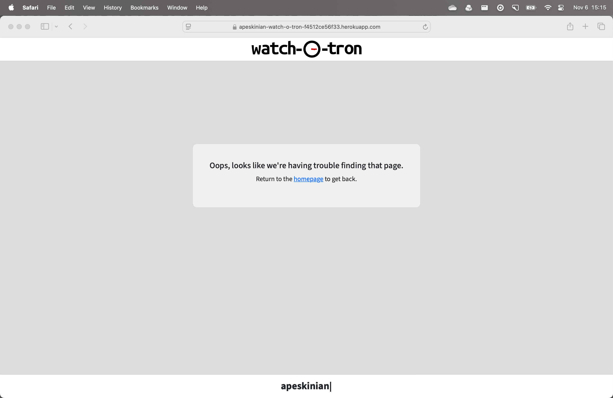
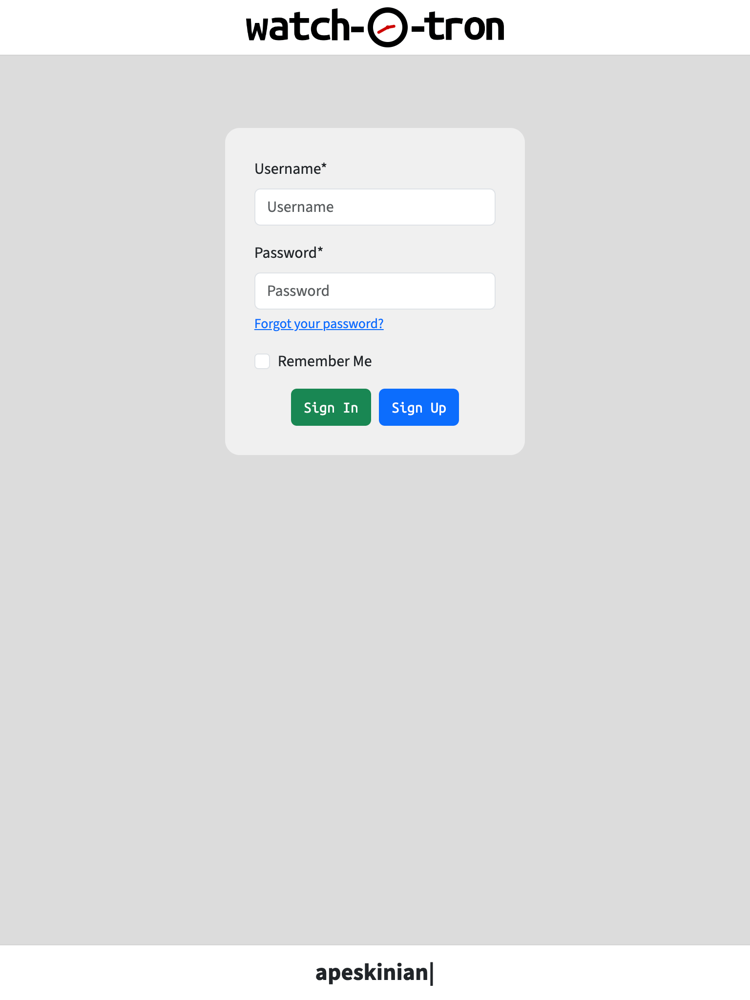
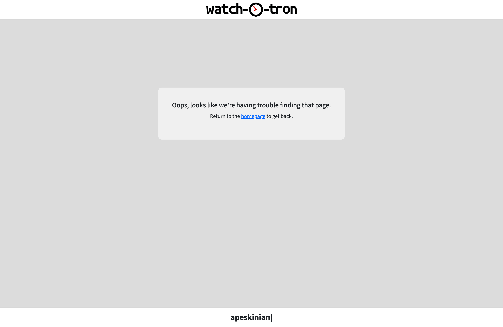
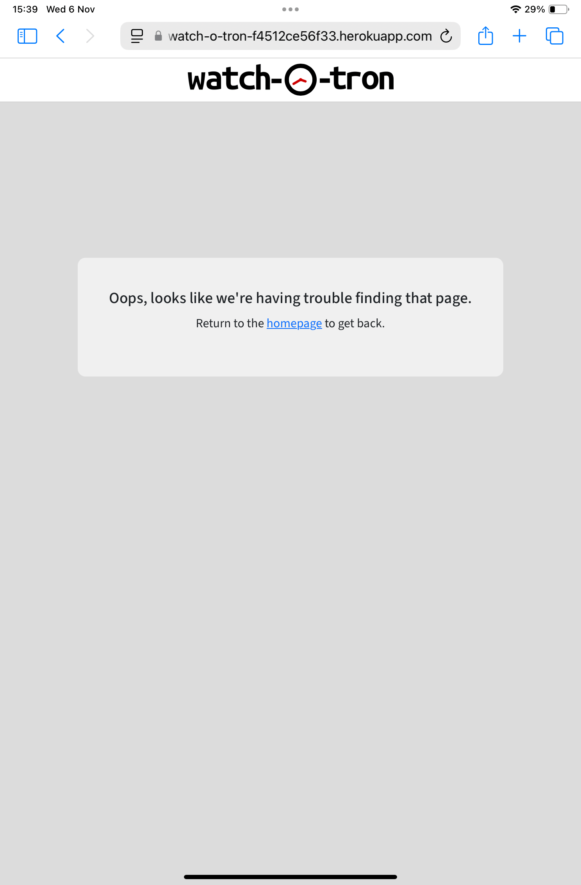
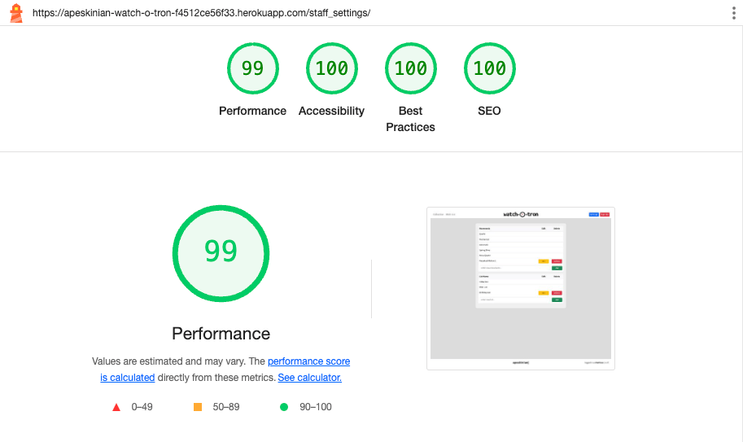
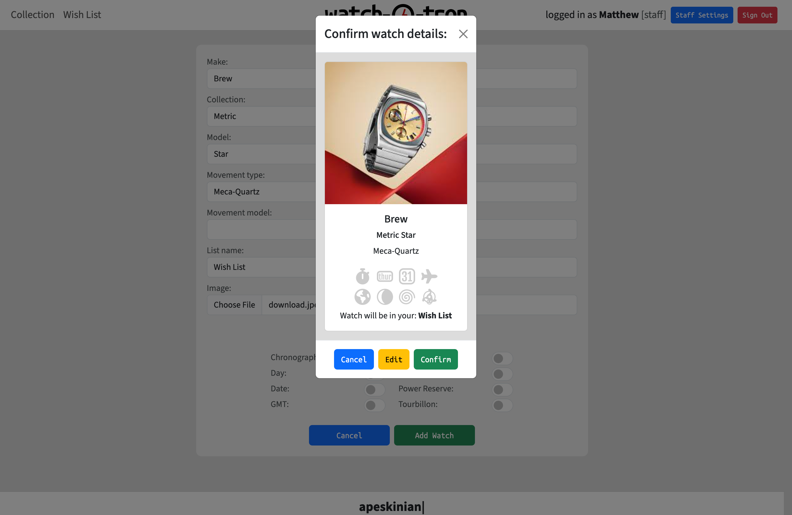
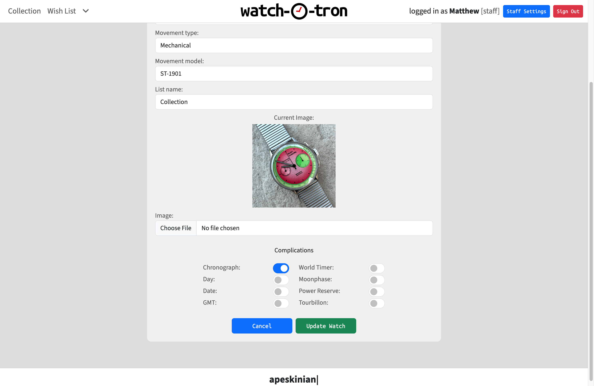
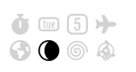

# Testing

> [!NOTE]  
> Return back to the [README.md](README.md) file.

## Code Validation

### HTML

I have used the recommended [HTML W3C Validator](https://validator.w3.org) to validate all of my HTML files.

> [!NOTE]  
> The main template and also other partial html files listed below were tested as part of the main site files as they include them.
> - base.html
> - clockface.html
> - messages.html
> - pagination.html
> - standard_nav.html

| Directory | File | Screenshot | Notes |
| --- | --- | --- | --- |
| templates | 404.html |  | no errors or warnings |
| templates/account | login.html |  | no errors or warnings |
| templates/account | logout.html |  | no errors or warnings |
| templates/account | signup.html |  | no errors or warnings |
| watches/templates/watches | index.html |  | |
| watches/templates/watches | manage_watch.html |  | no errors or warnings |
| watches/templates/watches | staff_settings.html |  | no errors or warnings |

### CSS

I have used the recommended [CSS Jigsaw Validator](https://jigsaw.w3.org/css-validator) to validate all of my CSS files.

| Directory | File | Screenshot | Notes |
| --- | --- | --- | --- |
| static | clockface.css |  | no errors found |
| static | style.css |  | no errors found |

### JavaScript

I have used the recommended [JShint Validator](https://jshint.com) to validate all of my JS files.

| Directory | File | Screenshot | Notes |
| --- | --- | --- | --- |
| static | base_script.js |  | bootstrap varable picked up as undefined and bootstrap variable tooltips marked as unused |
| static | edit_watch_script.js |  | bootstrap varable picked up as undefined |
| static | staff_settings_script.js |  | bootstrap varable picked up as undefined |
| static | watch_script.js |  | bootstrap varable picked up as undefined |

### Python

I have used the recommended [PEP8 CI Python Linter](https://pep8ci.herokuapp.com) to validate all of my Python files.

| Directory | File | CI URL | Screenshot | Notes |
| --- | --- | --- | --- | --- |
|  | manage.py | [PEP8 CI](https://pep8ci.herokuapp.com/https://raw.githubusercontent.com/apeskinian/p4_watch-o-tron/main/manage.py) |  | all clear, no errors found |
| watches | admin.py | [PEP8 CI](https://pep8ci.herokuapp.com/https://raw.githubusercontent.com/apeskinian/p4_watch-o-tron/main/watches/admin.py) |  | all clear, no errors found |
| watches | forms.py | [PEP8 CI](https://pep8ci.herokuapp.com/https://raw.githubusercontent.com/apeskinian/p4_watch-o-tron/main/watches/forms.py) |  | all clear, no errors found |
| watches | models.py | [PEP8 CI](https://pep8ci.herokuapp.com/https://raw.githubusercontent.com/apeskinian/p4_watch-o-tron/main/watches/models.py) |  | all clear, no errors found |
| watches | urls.py | [PEP8 CI](https://pep8ci.herokuapp.com/https://raw.githubusercontent.com/apeskinian/p4_watch-o-tron/main/watches/urls.py) |  | all clear, no errors found |
| watches | moons.py | [PEP8 CI](https://pep8ci.herokuapp.com/https://raw.githubusercontent.com/apeskinian/p4_watch-o-tron/main/watches/utils/moons.py) |  | all clear, no errors found |
| watches | views.py | [PEP8 CI](https://pep8ci.herokuapp.com/https://raw.githubusercontent.com/apeskinian/p4_watch-o-tron/main/watches/views.py) |  | all clear, no errors found |
| watchotron | settings.py | [PEP8 CI](https://pep8ci.herokuapp.com/https://raw.githubusercontent.com/apeskinian/p4_watch-o-tron/main/watchotron/settings.py) |  | added # noqa to lines 141, 144, 147 and 150 to ignore Django's long lines then all clear, no errors found |
| watchotron | urls.py | [PEP8 CI](https://pep8ci.herokuapp.com/https://raw.githubusercontent.com/apeskinian/p4_watch-o-tron/main/watchotron/urls.py) |  | all clear, no errors found |

## Browser Compatibility

I've tested my deployed project on multiple browsers to check for compatibility issues.

| Browser | Login | Logout | Signup | Home | Add/Edit Watch | Staff Settings | 404 | Notes |
| --- | --- | --- | --- | --- | --- | --- | --- | --- |
| Chrome |  |  |  |  |  |  |  | works as expected |
| Firefox |  |  |  |  |  |  |  | works as expected |
| Edge |  |  |  |  |  |  |  | works as expected |
| Safari |  |  |  |  |  |  |  | works as expected |

## Responsiveness

I've tested my deployed project on multiple devices to check for responsiveness issues.

| Device | Login | Logout | Signup | Home | Home with expanded menu | Add/Edit Watch | Staff Settings | 404 | Notes |
| --- | --- | --- | --- | --- | --- | --- | --- | --- | --- |
| Mobile (devtools) |  |  |  |  |  |  |  |  | tooltips only show on tap with mobile device |
| Tablet (devtools) |  |  |  |  |  |  |  |  | tooltips only show on tap with tablet device |
| Desktop (devtools) |  |  |  |  |  |  |  |  | works as expected |
| 4k Screen (devtools) |  |  |  |  |  |  |  |  | works as expected things starting to look a little small |
| iPhone 16 Pro |  |  |  |  |  |  |  |  | works as expected |
| iPad Mini |  |  |  |  |  |  |  |  | works as expected |
| Samsung Galaxy Tab 6 Lite |  |  |  |  |  |  |  |  | works as expected |
| Macbook Air M3 |  |  |  |  |  |  |  |  | works as expected |
| 2K Monitor |  |  |  |  |  |  |  |  | works as expected |

## Lighthouse Audit

I've tested my deployed project using the Lighthouse Audit tool to check for any major issues.

| Page | Mobile | Desktop | Notes |
| --- | --- | --- | --- |
| Login |  |  | Some minor warnings |
| Signup |  |  | Some minor warnings |
| Home |  |  | Slightly slower response time on mobile loading images |
| Add/Edit |  |  | Slightly slower performance on mobile caused by render blocking resources |
| Staff Settings |  |  | Some minor warnings |
| Logout |  |  | Some minor warnings |
| 404 | |  | Status code: 404 which is good for the 404 page plus some minor warnings |

## Defensive Programming

🛑🛑🛑🛑🛑🛑🛑🛑🛑🛑-START OF NOTES (to be deleted)

Defensive programming (defensive design) is extremely important!

When building projects that accept user inputs or forms, you should always test the level of security for each.
Examples of this could include (not limited to):

Forms:
- Users cannot submit an empty form
- Users must enter valid email addresses

PP3 (Python-only):
- Users must enter a valid letter/word/string when prompted
- Users must choose from a specific list only

MS3 (Flask) | MS4/PP4/PP5 (Django):
- Users cannot brute-force a URL to navigate to a restricted page
- Users cannot perform CRUD functionality while logged-out
- User-A should not be able to manipulate data belonging to User-B, or vice versa
- Non-Authenticated users should not be able to access pages that require authentication
- Standard users should not be able to access pages intended for superusers

You'll want to test all functionality on your application, whether it's a standard form,
or uses CRUD functionality for data manipulation on a database.
Make sure to include the `required` attribute on any form-fields that should be mandatory.
Try to access various pages on your site as different user types (User-A, User-B, guest user, admin, superuser).

You should include any manual tests performed, and the expected results/outcome.

Testing should be replicable.
Ideally, tests cases should focus on each individual section of every page on the website.
Each test case should be specific, objective, and step-wise replicable.

Instead of adding a general overview saying that everything works fine,
consider documenting tests on each element of the page
(ie. button clicks, input box validation, navigation links, etc.) by testing them in their happy flow,
and also the bad/exception flow, mentioning the expected and observed results,
and drawing a parallel between them where applicable.

Consider using the following format for manual test cases:

Expected Outcome / Test Performed / Result Received / Fixes Implemented

- **Expected**: "Feature is expected to do X when the user does Y."
- **Testing**: "Tested the feature by doing Y."
- (either) **Result**: "The feature behaved as expected, and it did Y."
- (or) **Result**: "The feature did not respond to A, B, or C."
- **Fix**: "I did Z to the code because something was missing."

Use the table below as a basic start, and expand on it using the logic above.

🛑🛑🛑🛑🛑🛑🛑🛑🛑🛑-END OF NOTES (to be deleted)

Defensive programming was manually tested with the below user acceptance testing:

### Creating a new user account

| Page | Expectation | Test | Result | Fix | Screenshot |
| --- | --- | --- | --- | --- | --- |
| Login | | | | | |
| | New user clicks on sign up link and is taken to the sign up page | Tested by clicking on the signup link on the login page | SUCCESS - user is taken to signup page | n/a |  |
| Signup | | | | | |
| | New user clicks signup without entering any info and is informed of required fields. | Clicking on the signup button without entering data. | SUCCESS - user is informed that the form is not complete | n/a |  |
| | New user clicks signup after entering just a username and is informed of required fields. | Clicking on the signup button with just a username entered. | SUCCESS - user is informed that the form is not complete | n/a |  |
| | New user clicks signup after entering just a password and is informed of required fields. | Clicking on the signup button with just a password entered. | SUCCESS - user is informed that the form is not complete | n/a |  |
| | New user clicks signup after entering an invalid username and is informed of this. | Clicking on the signup button with an invalid username. | SUCCESS - user is informed that the form is not valid | n/a |  |
| | New user clicks signup after entering an invalid password and is informed of this. | Clicking on the signup button with an invalid password. | SUCCESS - user is informed that the form is not valid | n/a |  |
| | New user clicks signup after entering mismatching passwords and is informed of this. | Clicking on the signup button with mismatched passwords. | SUCCESS - user is informed that the form is not valid | n/a |  |
| | New user clicks signup after entering valid username and password. They are then logged in and taken to the homepage  | Clicking on the signup button with valid info. | SUCCESS - user is created and logged in | n/a |  |

### Logging in

| Page | Expectation | Test | Result | Fix | Screenshot |
| --- | --- | --- | --- | --- | --- |
| Login | | | | | |
| | User clicks on sign in without entering username or password and is informed of required fields. | Clicking on sign in without entering username or password. | SUCCESS - user is informed that the form is not complete. | n/a |  |
| | User clicks on sign in without entering password and is informed of required fields. | Clicking on sign in without entering password. | SUCCESS - user is informed that the form is not complete. | n/a |  |
| | User clicks on sign in without entering username and is informed of required fields. | Clicking on sign in without entering username. | SUCCESS - user is informed that the form is not complete. | n/a |  |
| | User clicks on sign in with invalid username or password and is informed of invalid input. | Clicking on sign in with invalid username or password. | SUCCESS - user is informed that the form is not valid. | n/a |  |
| | User clicks on sign in with valid username an password and is taken to homepage. | Clicking on sign in with valid username and password. | SUCCESS - user is logged in and taken to homepage. | n/a |  |

## User Story Testing

| User Story | Screenshot |
| --- | --- |
| As a new site user, I can sign up for an account so that I can log in and use the app. |  |
| As a site user, I can log in so that I can use the app. |  |
| As a site user, I can log out so that I can keep my data private. |  |
| As a site user, I am notified on successful login and logout so that I know that I am logged in or out. |   |
| As a site user, I can view my watch collection so that I can view images and details of the watches I own. |  |
| As a site user, I can view my wish list so that I can see what watches I want or plan my next purchase. |  |
| As a site user, I can view watches that I have placed in potentially added new list types so that I can see the watch details for this list. |  |
| As a site user, I can see the details of each watch so that I can find out more information about them. |  |
| As a site user, I am notified when I have switched views to a new list so that I know which list I am viewing. |   |
| As a site user, I can add a new watch so that I ca see it in my collection or wish list. |  |
| As a site user, I am asked to confirm new watch details I entered are correct so that no accidental erroneous data is saved. |  |
| As a site user, I am notified when a watch has been added successfully so that I know the addition was successful or not. |  |
| As a site user, I can see a spinner when I click add watch so that I know something is happening. |  |
| As a site user, I should be prompted to confirm watch deletions so that I do not delete watches by accident. |  |
| As a site user, I can edit stored watches in my collection so that I can add more detail or update existing information. |  |
| As a site user, I can move a watch in my wish list to my collection so that I know that I have purchased it. |  |
| As a site user, I can delete a watch from the wish list so that I can update my wish list should I no longer want a particular watch. |  |
| As a site user, I can delete a watch from a new list type so that I can update this list when I no longer want the watch to appear in it. |  |
| As a site user, I can edit stored watches in my wish list so that I can add more detail or update existing information. |  |
| As a site user, I can edit stored watches in a new list type so that I can add more detail or update existing information. |  |
| As a site user, I can delete a watch from my collection so that I can update my lists if I no longer own a particular watch. |  |
| As a site user, I should be prompted to confirm alterations so that edits are correct. |  |
| As a site user, I should be asked to confirm when I set a watch as purchased so that I don't accidentally move a watch to my collection if I haven't bought it. |  |
| As a site user, I am notified after editing and deleting watches so that I know if the process was successful. |   |
| As a site user, I am notified when I move a watch to the collection so that it is confirmed whether the process was successful. |  |
| As a site user, I can see a spinner when I confirm a watch edit so that I know something is happening. |  |
| As a curious site user, I can discover a hidden Easter egg in the site logo so that I experience an unexpected, delightful surprise within the application. |  |
| As a curious site user, I can discover a hidden Easter egg in the date complication icon so that I experience an unexpected, delightful surprise within the application. |  |
| As a curious site user, I can discover a hidden Easter egg in the day complication icon so that I experience an unexpected, delightful surprise within the application. |  |
| As a curious site user, I can discover a hidden Easter egg in the moon phase complication icon so that I experience an unexpected, delightful surprise within the application. |  |
| As a client, I can log in as a staff member so that I can add potential new, important options for users. |  |
| As a site staff member, I can add new watch movement types to the model so that users can add watches with any new movement types that may become available in the future. |  |
| As a site staff member, I can add new list types so that users can expand their lists from collection and wish list to other types specified by the site staff member. |  |
| As a site staff member, I can edit any movement types I have added so that I can change them if needed. |  |
| As a site staff member, I can delete any new movement types so that I can keep the list relevant. |  |
| As a site staff member, I can edit any added list types so that I keep the app up to date. |  |
| As a site staff member, I can delete custom added lists so that I can remove any unwanted list types. |  |
| As a staff member, I am notified about edits and deletes I make for custom movements so that I know if the change was successful. |   |
| As a staff member, I am notified of successful list edits and deletions so that I know the process was successful. |   |
| As a site admin, I can log in as a super user so that I can access the admin panel. |  |

## Automated Testing

I have conducted a series of automated tests on my application.

I fully acknowledge and understand that, in a real-world scenario, an extensive set of additional tests would be more comprehensive.

### Python (Unit Testing)

🛑🛑🛑🛑🛑🛑🛑🛑🛑🛑-START OF NOTES (to be deleted)

Adjust the code below (file names, etc.) to match your own project files/folders.

🛑🛑🛑🛑🛑🛑🛑🛑🛑🛑-END OF NOTES (to be deleted)

I have used Django's built-in unit testing framework to test the application functionality.

In order to run the tests, I ran the following command in the terminal each time:

`python3 manage.py test name-of-app`

To create the coverage report, I would then run the following commands:

`pip3 install coverage`

`pip3 freeze --local > requirements.txt`

`coverage run --omit=*/site-packages/*,*/migrations/*,*/__init__.py,env.py manage.py test`

`coverage report`

To see the HTML version of the reports, and find out whether some pieces of code were missing, I ran the following commands:

`coverage html`

`python3 -m http.server`

Below are the results from the various apps on my application that I've tested:

| App | File | Coverage | Screenshot |
| --- | --- | --- | --- |
| Bag | test_forms.py | 99% |  |
| Bag | test_models.py | 89% |  |
| Bag | test_urls.py | 100% |  |
| Bag | test_views.py | 71% |  |
| Checkout | test_forms.py | 99% |  |
| Checkout | test_models.py | 89% |  |
| Checkout | test_urls.py | 100% |  |
| Checkout | test_views.py | 71% |  |
| Home | test_forms.py | 99% |  |
| Home | test_models.py | 89% |  |
| Home | test_urls.py | 100% |  |
| Home | test_views.py | 71% |  |
| Products | test_forms.py | 99% |  |
| Products | test_models.py | 89% |  |
| Products | test_urls.py | 100% |  |
| Products | test_views.py | 71% |  |
| Profiles | test_forms.py | 99% |  |
| Profiles | test_models.py | 89% |  |
| Profiles | test_urls.py | 100% |  |
| Profiles | test_views.py | 71% |  |
| x | x | x | repeat for all remaining tested apps/files |

#### Unit Test Issues

🛑🛑🛑🛑🛑🛑🛑🛑🛑🛑-START OF NOTES (to be deleted)

Use this section to list any known issues you ran into while writing your unit tests.
Remember to include screenshots (where possible), and a solution to the issue (if known).

This can be used for both "fixed" and "unresolved" issues.

🛑🛑🛑🛑🛑🛑🛑🛑🛑🛑-END OF NOTES (to be deleted)

## Bugs

🛑🛑🛑🛑🛑🛑🛑🛑🛑🛑-START OF NOTES (to be deleted)

This section is primarily used for JavaScript and Python applications,
but feel free to use this section to document any HTML/CSS bugs you might run into.

It's very important to document any bugs you've discovered while developing the project.
Make sure to include any necessary steps you've implemented to fix the bug(s) as well.

**PRO TIP**: screenshots of bugs are extremely helpful, and go a long way!

🛑🛑🛑🛑🛑🛑🛑🛑🛑🛑-END OF NOTES (to be deleted)

- JS Uncaught ReferenceError: `foobar` is undefined/not defined

    

    - To fix this, I _____________________.

- JS `'let'` or `'const'` or `'template literal syntax'` or `'arrow function syntax (=>)'` is available in ES6 (use `'esversion: 11'`) or Mozilla JS extensions (use moz).

    

    - To fix this, I _____________________.

- Python `'ModuleNotFoundError'` when trying to import module from imported package

    

    - To fix this, I _____________________.

- Django `TemplateDoesNotExist` at /appname/path appname/template_name.html

    

    - To fix this, I _____________________.

- Python `E501 line too long` (93 > 79 characters)

    

    - To fix this, I _____________________.

### GitHub **Issues**

🛑🛑🛑🛑🛑🛑🛑🛑🛑🛑-START OF NOTES (to be deleted)

An improved way to manage bugs is to use the built-in **Issues** tracker on your GitHub repository.
To access your Issues, click on the "Issues" tab at the top of your repository.
Alternatively, use this link: https://github.com/apeskinian/p4_watch-o-tron/issues

If using the Issues tracker for your bug management, you can simplify the documentation process.
Issues allow you to directly paste screenshots into the issue without having to first save the screenshot locally,
then uploading into your project.

You can add labels to your issues (`bug`), assign yourself as the owner, and add comments/updates as you progress with fixing the issue(s).

Once you've sorted the issue, you should then "Close" it.

When showcasing your bug tracking for assessment, you can use the following format:

🛑🛑🛑🛑🛑🛑🛑🛑🛑🛑-END OF NOTES (to be deleted)

**Fixed Bugs**

All previously closed/fixed bugs can be tracked [here](https://github.com/apeskinian/p4_watch-o-tron/issues?q=is%3Aissue+is%3Aclosed).

| Bug | Status |
| --- | --- |
| [JS Uncaught ReferenceError: `foobar` is undefined/not defined](https://github.com/apeskinian/p4_watch-o-tron/issues/1) | Closed |
| [Python `'ModuleNotFoundError'` when trying to import module from imported package](https://github.com/apeskinian/p4_watch-o-tron/issues/2) | Closed |
| [Django `TemplateDoesNotExist` at /appname/path appname/template_name.html](https://github.com/apeskinian/p4_watch-o-tron/issues/3) | Closed |

**Open Issues**

Any remaining open issues can be tracked [here](https://github.com/apeskinian/p4_watch-o-tron/issues).

| Bug | Status |
| --- | --- |
| [JS `'let'` or `'const'` or `'template literal syntax'` or `'arrow function syntax (=>)'` is available in ES6 (use `'esversion: 11'`) or Mozilla JS extensions (use moz).](https://github.com/apeskinian/p4_watch-o-tron/issues/4) | Open |
| [Python `E501 line too long` (93 > 79 characters)](https://github.com/apeskinian/p4_watch-o-tron/issues/5) | Open |

## Unfixed Bugs

🛑🛑🛑🛑🛑🛑🛑🛑🛑🛑-START OF NOTES (to be deleted)

You will need to mention unfixed bugs and why they were not fixed.
This section should include shortcomings of the frameworks or technologies used.
Although time can be a big variable to consider, paucity of time and difficulty understanding
implementation is not a valid reason to leave bugs unfixed.

If you've identified any unfixed bugs, no matter how small, be sure to list them here.
It's better to be honest and list them, because if it's not documented and an assessor finds the issue,
they need to know whether or not you're aware of them as well, and why you've not corrected/fixed them.

Some examples:

🛑🛑🛑🛑🛑🛑🛑🛑🛑🛑-END OF NOTES (to be deleted)

- On devices smaller than 375px, the page starts to have `overflow-x` scrolling.

    

    - Attempted fix: I tried to add additional media queries to handle this, but things started becoming too small to read.

- For PP3, when using a helper `clear()` function, any text above the height of the terminal does not clear, and remains when you scroll up.

    

    - Attempted fix: I tried to adjust the terminal size, but it only resizes the actual terminal, not the allowable area for text.

- When validating HTML with a semantic `section` element, the validator warns about lacking a header `h2-h6`. This is acceptable.

    

    - Attempted fix: this is a known warning and acceptable, and my section doesn't require a header since it's dynamically added via JS.

🛑🛑🛑🛑🛑🛑🛑🛑🛑🛑-START OF NOTES (to be deleted)

If you legitimately cannot find any unfixed bugs or warnings, then use the following sentence:

🛑🛑🛑🛑🛑🛑🛑🛑🛑🛑-END OF NOTES (to be deleted)

> [!NOTE]  
> There are no remaining bugs that I am aware of.
