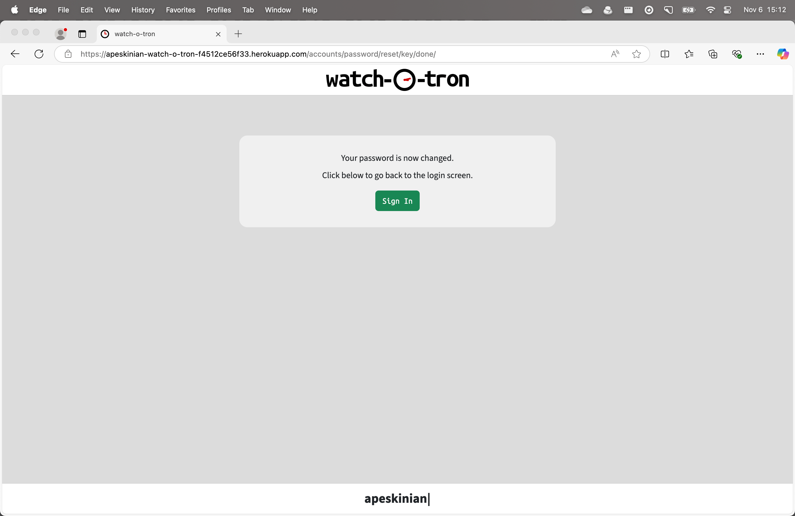
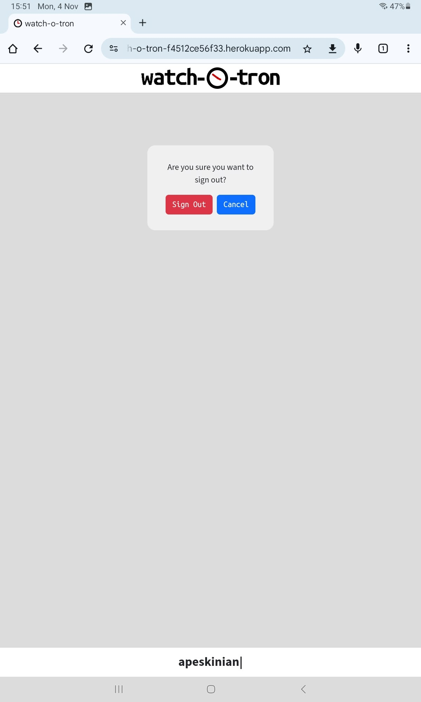
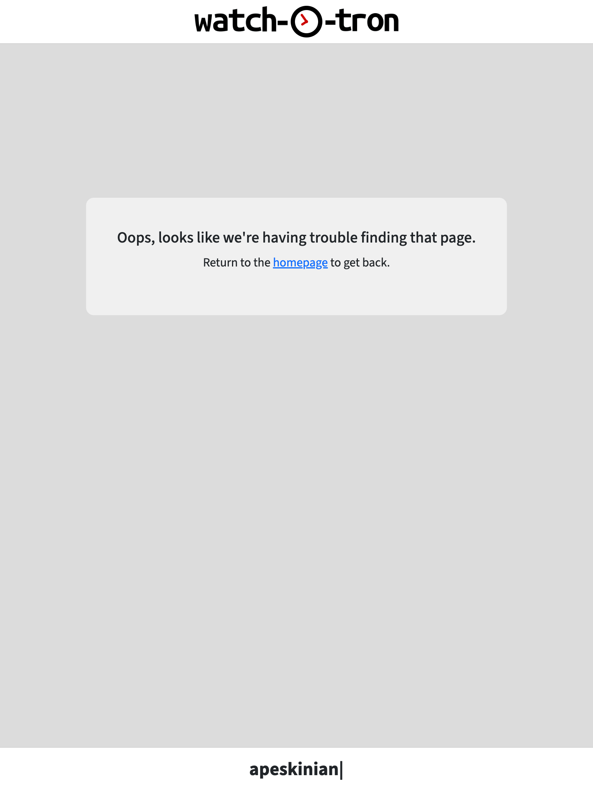
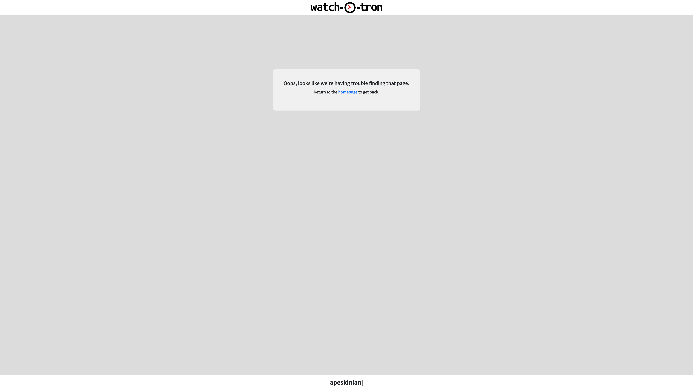
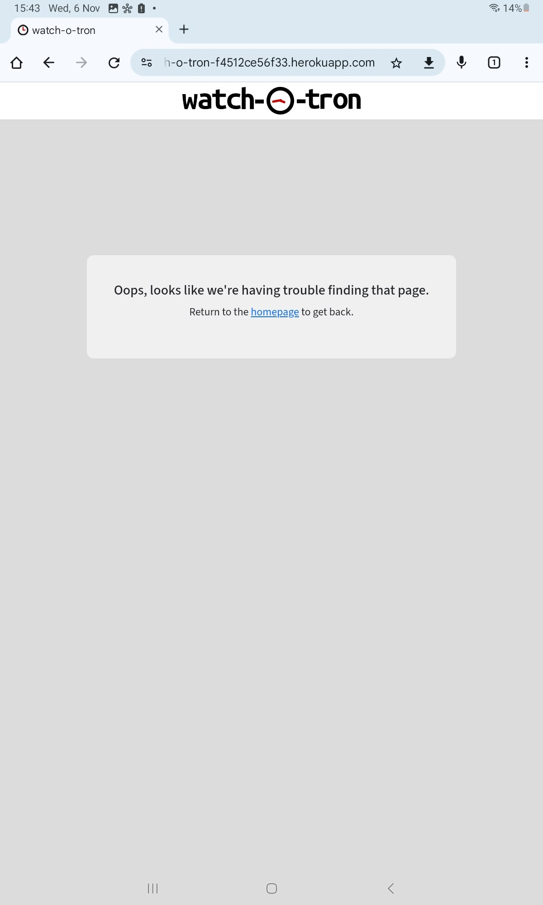
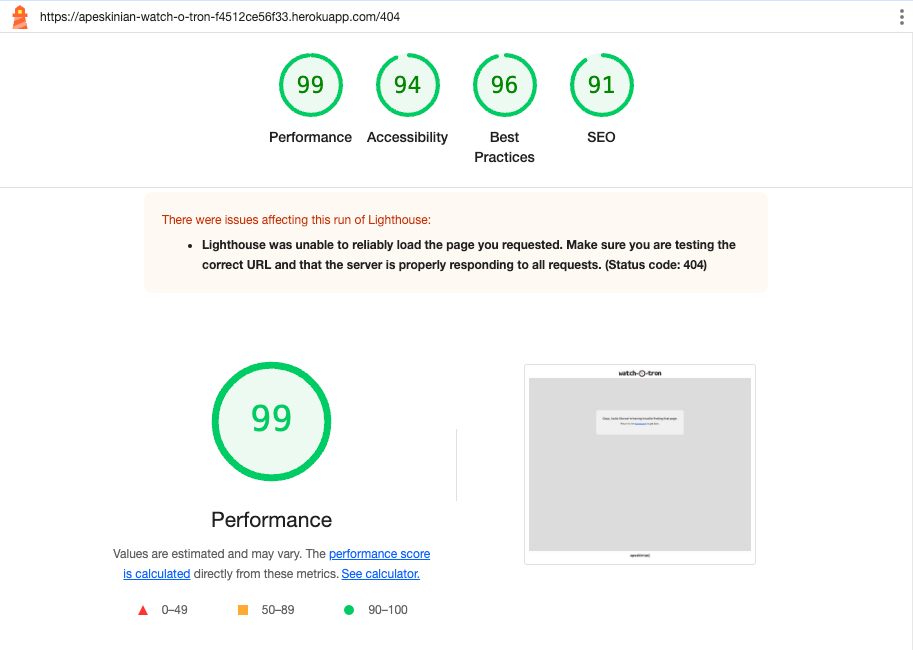

# Testing

> [!NOTE]  
> Return back to the [README.md](README.md) file.

## Code Validation

### HTML

I have used the recommended [HTML W3C Validator](https://validator.w3.org) to validate all of my HTML files.

> [!NOTE]  
> The main template and also other partial html files listed below were tested as part of the main site files as they include them.
> - base.html
> - account_nav.html
> - clockface.html
> - messages.html
> - pagination.html
> - standard_nav.html

| Directory | File | Screenshot | Notes |
| --- | --- | --- | --- |
| templates | 404.html |  | no errors or warnings |
| templates | 500.html |  | no errors or warnings |
| templates/account | login.html |  | no errors or warnings |
| templates/account | logout.html |  | no errors or warnings |
| templates/account | signup.html |  | no errors or warnings |
| templates/account | password_reset.html |  | no errors or warnings |
| templates/account | password_reset_done.html |  | no errors or warnings |
| templates/account | password_reset_from_key.html |  | no errors or warnings |
| templates/account | password_reset_from_key_done.html |  | no errors or warnings |
| watches/templates/watches | index.html |  | |
| watches/templates/watches | manage_watch.html |  | no errors or warnings |
| watches/templates/watches | staff_settings.html |  | no errors or warnings |

### CSS

I have used the recommended [CSS Jigsaw Validator](https://jigsaw.w3.org/css-validator) to validate all of my CSS files.

| Directory | File | Screenshot | Notes |
| --- | --- | --- | --- |
| static | clockface.css |  | no errors found |
| static | style.css |  | no errors found |

### JavaScript

I have used the recommended [JShint Validator](https://jshint.com) to validate all of my JS files.

| Directory | File | Screenshot | Notes |
| --- | --- | --- | --- |
| static | base_script.js |  | bootstrap varable picked up as undefined and bootstrap variable tooltips marked as unused |
| static | edit_watch_script.js |  | bootstrap varable picked up as undefined |
| static | staff_settings_script.js |  | bootstrap varable picked up as undefined |
| static | watch_script.js |  | bootstrap varable picked up as undefined |

### Python

I have used the recommended [PEP8 CI Python Linter](https://pep8ci.herokuapp.com) to validate all of my Python files.

| Directory | File | CI URL | Screenshot | Notes |
| --- | --- | --- | --- | --- |
|  | manage.py | [PEP8 CI](https://pep8ci.herokuapp.com/https://raw.githubusercontent.com/apeskinian/p4_watch-o-tron/main/manage.py) |  | all clear, no errors found |
| watches | admin.py | [PEP8 CI](https://pep8ci.herokuapp.com/https://raw.githubusercontent.com/apeskinian/p4_watch-o-tron/main/watches/admin.py) |  | all clear, no errors found |
| watches | forms.py | [PEP8 CI](https://pep8ci.herokuapp.com/https://raw.githubusercontent.com/apeskinian/p4_watch-o-tron/main/watches/forms.py) |  | all clear, no errors found |
| watches | models.py | [PEP8 CI](https://pep8ci.herokuapp.com/https://raw.githubusercontent.com/apeskinian/p4_watch-o-tron/main/watches/models.py) |  | all clear, no errors found |
| watches | urls.py | [PEP8 CI](https://pep8ci.herokuapp.com/https://raw.githubusercontent.com/apeskinian/p4_watch-o-tron/main/watches/urls.py) |  | all clear, no errors found |
| watches | moons.py | [PEP8 CI](https://pep8ci.herokuapp.com/https://raw.githubusercontent.com/apeskinian/p4_watch-o-tron/main/watches/utils/moons.py) |  | all clear, no errors found |
| watches | views.py | [PEP8 CI](https://pep8ci.herokuapp.com/https://raw.githubusercontent.com/apeskinian/p4_watch-o-tron/main/watches/views.py) |  | all clear, no errors found |
| watchotron | settings.py | [PEP8 CI](https://pep8ci.herokuapp.com/https://raw.githubusercontent.com/apeskinian/p4_watch-o-tron/main/watchotron/settings.py) |  | added # noqa to lines 141, 144, 147 and 150 to ignore Django's long lines then all clear, no errors found |
| watchotron | urls.py | [PEP8 CI](https://pep8ci.herokuapp.com/https://raw.githubusercontent.com/apeskinian/p4_watch-o-tron/main/watchotron/urls.py) |  | all clear, no errors found |

## Browser Compatibility

I've tested my deployed project on multiple browsers to check for compatibility issues.

### Account pages
| Browser | Login | Logout | Signup | Forgot Password | Password Request Sent | Password Reset From Email Link | Password Changed | Notes |
| --- | --- | --- | --- | --- | --- | --- | --- | --- |
| Chrome |  |  |  |  |  |  |  | works as expected |
| Firefox |  |  |  |  |  |  |  | works as expected |
| Edge |  |  |  |  |  |  |  | works as expected |
| Safari |  |  |  |  |  |  |  | works as expected |

### Main site
| Browser | Home | Add/Edit Watch | Staff Settings | 404 | 500 | Notes |
| --- | --- | --- | --- | --- | --- | --- |
| Chrome |  |  |  |  |  | works as expected |
| Firefox |  |  |  |  |  | works as expected |
| Edge |  |  |  |  |  | works as expected |
| Safari |  |  |  |  |  | works as expected |

## Responsiveness

I've tested my deployed project on multiple devices to check for responsiveness issues.

### Account Pages

| Device | Login | Logout | Signup | Forgot Password | Password Request Sent | Password Reset From Email Link | Password Changed | Notes |
| --- | --- | --- | --- | --- | --- | --- | --- | --- |
| Mobile (devtools) |  |  |  |  |  |  |  | works as expected |
| Tablet (devtools) |  |  |  |  |  |  |  | works as expected |
| Desktop (devtools) |  |  |  |  |  |  |  | works as expected |
| 4k Screen (devtools) |  |  |  |  |  |  |  | works as expected things starting to look a little small |
| iPhone 16 Pro |  |  |  |  |  |  |  | works as expected |
| iPad Mini |  |  |  |  |  |  |  | works as expected |
| Samsung Galaxy Tab 6 Lite |  |  |  |  |  |  |  | works as expected |
| Macbook Air M3 |  |  |  |  |  |  |  | works as expected |
| 2K Monitor |  |  |  |  |  |  |  | works as expected |

### Main Site

| Device | Home | Home with expanded menu | Add/Edit Watch | Staff Settings | 404 | 500 | Notes |
| --- | --- | --- | --- | --- | --- | --- | --- |
| Mobile (devtools) |  |  |  |  |  |  | tooltips only show on tap with mobile device |
| Tablet (devtools) |  |  |  |  |  |  | tooltips only show on tap with tablet device |
| Desktop (devtools) |  |  |  |  |  |  | works as expected |
| 4k Screen (devtools) |  |  |  |  |  |  | works as expected things starting to look a little small |
| iPhone 16 Pro |  |  |  |  |  |  | works as expected |
| iPad Mini |  |  |  |  |  |  | works as expected |
| Samsung Galaxy Tab 6 Lite |  |  |  |  |  |  | works as expected |
| Macbook Air M3 |  |  |  |  |  |  | works as expected |
| 2K Monitor |  |  |  |  |  |  | works as expected |

## Lighthouse Audit

I've tested my deployed project using the Lighthouse Audit tool to check for any major issues.

| Page | Mobile | Desktop | Notes |
| --- | --- | --- | --- |
| Login |  |  | Some minor warnings |
| Signup |  |  | Some minor warnings |
| Forgot Password |  |  | Some minor warnings |
| Password Request Sent |  |  | Some minor warnings |
| Reset Password from Email Link |  |  | Some minor warnings |
| Password Changed |  |  | Some minor warnings |
| Home |  |  | Slightly slower response time on mobile loading images |
| Add/Edit |  |  | Slightly slower performance on mobile caused by render blocking resources |
| Staff Settings |  |  | Some minor warnings |
| Logout |  |  | Some minor warnings |
| 404 | |  | Status code: 404 which is good for the 404 error page plus some minor warnings |
| 500 | |  | Status code: 500 which is good for the 500 error page plus some minor warnings |

## Defensive Programming

🛑🛑🛑🛑🛑🛑🛑🛑🛑🛑-START OF NOTES (to be deleted)

Defensive programming (defensive design) is extremely important!

When building projects that accept user inputs or forms, you should always test the level of security for each.
Examples of this could include (not limited to):

Forms:
- Users cannot submit an empty form
- Users must enter valid email addresses

PP3 (Python-only):
- Users must enter a valid letter/word/string when prompted
- Users must choose from a specific list only

MS3 (Flask) | MS4/PP4/PP5 (Django):
- Users cannot brute-force a URL to navigate to a restricted page
- Users cannot perform CRUD functionality while logged-out
- User-A should not be able to manipulate data belonging to User-B, or vice versa
- Non-Authenticated users should not be able to access pages that require authentication
- Standard users should not be able to access pages intended for superusers

You'll want to test all functionality on your application, whether it's a standard form,
or uses CRUD functionality for data manipulation on a database.
Make sure to include the `required` attribute on any form-fields that should be mandatory.
Try to access various pages on your site as different user types (User-A, User-B, guest user, admin, superuser).

You should include any manual tests performed, and the expected results/outcome.

Testing should be replicable.
Ideally, tests cases should focus on each individual section of every page on the website.
Each test case should be specific, objective, and step-wise replicable.

Instead of adding a general overview saying that everything works fine,
consider documenting tests on each element of the page
(ie. button clicks, input box validation, navigation links, etc.) by testing them in their happy flow,
and also the bad/exception flow, mentioning the expected and observed results,
and drawing a parallel between them where applicable.

Consider using the following format for manual test cases:

Expected Outcome / Test Performed / Result Received / Fixes Implemented

- **Expected**: "Feature is expected to do X when the user does Y."
- **Testing**: "Tested the feature by doing Y."
- (either) **Result**: "The feature behaved as expected, and it did Y."
- (or) **Result**: "The feature did not respond to A, B, or C."
- **Fix**: "I did Z to the code because something was missing."

Use the table below as a basic start, and expand on it using the logic above.

🛑🛑🛑🛑🛑🛑🛑🛑🛑🛑-END OF NOTES (to be deleted)

Defensive programming was manually tested with the below user acceptance testing:

### Creating a new user account
| Expectation | Test | Result | Fix | Screenshot |
| --- | --- | --- | --- | --- |
| New user clicks on sign up link and is taken to the sign up page | Tested by clicking on the signup link on the login page | SUCCESS - user is taken to signup page | n/a |  |
| New user clicks signup without entering any info and is informed of required fields. | Clicking on the signup button without entering data. | SUCCESS - user is informed that the form is not complete | n/a |  |
| New user clicks signup after entering just a username and is informed of required fields. | Clicking on the signup button with just a username entered. | SUCCESS - user is informed that the form is not complete | n/a |  |
| New user clicks signup after entering just a password and is informed of required fields. | Clicking on the signup button with just a password entered. | SUCCESS - user is informed that the form is not complete | n/a |  |
| New user clicks signup after entering an invalid username and is informed of this. | Clicking on the signup button with an invalid username. | SUCCESS - user is informed that the form is not valid | n/a |  |
| New user clicks signup after entering an invalid password and is informed of this. | Clicking on the signup button with an invalid password. | SUCCESS - user is informed that the form is not valid | n/a |  |
| New user clicks signup after entering mismatching passwords and is informed of this. | Clicking on the signup button with mismatched passwords. | SUCCESS - user is informed that the form is not valid | n/a |  |
| New user clicks signup after entering valid username and password. They are then logged in and taken to the homepage  | Clicking on the signup button with valid info. | SUCCESS - user is created and logged in | n/a |  |

### Logging in
| Expectation | Test | Result | Fix | Screenshot |
| --- | --- | --- | --- | --- |
| User clicks on sign in without entering username or password and is informed of required fields. | Clicking on sign in without entering username or password. | SUCCESS - user is informed that the form is not complete. | n/a |  |
| User clicks on sign in without entering password and is informed of required fields. | Clicking on sign in without entering password. | SUCCESS - user is informed that the form is not complete. | n/a |  |
| User clicks on sign in without entering username and is informed of required fields. | Clicking on sign in without entering username. | SUCCESS - user is informed that the form is not complete. | n/a |  |
| User clicks on sign in with invalid username or password and is informed of invalid input. | Clicking on sign in with invalid username or password. | SUCCESS - user is informed that the form is not valid. | n/a |  |
| User clicks on sign in with valid username an password and is taken to homepage. | Clicking on sign in with valid username and password. | SUCCESS - user is logged in and taken to homepage. | n/a |  |

### Resetting password
| Expectation | Test | Result | Fix | Screenshot |
| --- | --- | --- | --- | --- |
| User clicks on forgot password link and is taken to the page to enter an email address | Clicking on forgot password link. | SUCCESS - user is taken to the page to input an email address | n/a |  |
| User enters no email address in forgot password field and is informed of required field. | Not entering an email address into the form. | SUCCESS - user is informed of required field | n/a |  |
| User enters invalid email address in forgot password field and is informed of invalid form. | Entering an invalid email into the form. | SUCCESS - user is informed of invalid email address | n/a |  |
| User enters valid email address in forgot password field and is shown confirmation page. | Entering a valid email into the form. | SUCCESS - user is shown the confirmation page | n/a |  |
| User receives an email with link to reset password. | Checking to see if email is received. | SUCCESS - email is received with link to reset | n/a |  |
| User enters nothing in password reset form and is informed of required fields. | Entering nothing the fields and submitting form. | SUCCESS - user is informed of invalid form | n/a |  |
| User enters invalid password in form and is informed of invalid form. | Entering invalid passwords in the fields and submitting form. | SUCCESS - user is informed of invalid form | n/a |  |
| User enters mismatched passwords in form and is informed of invalid form. | Entering mismatched passwords in the fields and submitting form. | SUCCESS - user is informed of invalid form | n/a |  |
| User enters correct input in password reset form and is shown the confirmation page. | Entering matching valid passwords in the fields and submitting form. | SUCCESS - user is shown the confirmation page | n/a |  |
| User clicks on Sign In to return to login page. | Clicking on Sign In from the password reset confirmation page. | SUCCESS - user is taken to the login page. | n/a |  |

### Home page - [viewing watches and switching lists, purchasing and deleting watches]
| Expectation | Test | Result | Fix | Screenshot |
| --- | --- | --- | --- | --- |
| User can scroll and view watches including navigating paginated lists. User is also notified of which page and list they are viewing via messages. | Scrolling the view and clicking on the pagination links. | SUCCESS - user can view all the watches clearly in a list including using pagination. They are also informed of current page and list via messages. | n/a |  |
| User can switch between lists using the navigation links including custom links from the dropdown. They are also notified of which list and page (if needed) via messages. | Clicking on the different list links in the navbar including the dropdown. | SUCCESS - user can navigate through the lists using the links in the navbar and is notified of which list they are viewing via messages. | n/a |  |
| User can click on the main logo to return to the home screen and collection. | Click on the main logo at the top. | SUCCESS - the user is taken to the main home screen showing their collection. | n/a |  |
| User can access a watch's action buttons by clicking on the watch, if in the wish list the purchased button is also available. | Click on watches to confirm action buttons are shown. Try this in the wish list as well as a normal list type. | SUCCESS - the watch's action buttons are shown upon clicking on the watch. Wish list watches show the additional purchased action button. | n/a |  |
| User can set a watch in the wish list as purchased and it is moved to the collection. They are then informed of the move via messages and taken to the collection. | Clicking on a watch's purchased action button in the wish list and then confirming choice. | SUCCESS - watch is moved to the collection and the user is notified and taken to the collection | n/a |  |
| User can cancel a decision to set a watch in the wish list as purchased via the cancel button. The watch is not moved and the user stays in the wish list | Clicking on a watch's purchased action button in the wish list and then clicking on cancel. | SUCCESS - watch remains in the wish list and the user is notified of the cancellation, the view also remains in the wish list. | n/a |  |
| User can cancel a decision to set a watch in the wish list as purchased via the modal close button. The watch is not moved and the user stays in the wish list | Clicking on a watch's purchased action button in the wish list and then clicking the modal close button. | SUCCESS - watch remains in the wish list and the user is notified of the cancellation, the view also remains in the wish list. | n/a |  |
| Clicking outside of the purchased confirm modal should not do anything. | Click outside of the purchased confirmation modal. | SUCCESS - cicking outside of the modal does nothing. | n/a |  |
| User can delete a watch and is notified of the deletion. | Click on a watch's delete action button and confirming the choice. | SUCCESS - watch is deleted and user is notified. | n/a |  |
| User can cancel the deletion of a watch via the cancel button and is notified of the cancellation. | Click on a watch's delete action button and then clicking cancel. | SUCCESS - watch deletion is cancelled and user is notified. | n/a |  |
| User can cancel the deletion of a watch via the modal close button and is notified of the cancellation. | Click on a watch's delete action button and then clicking on the modal close button. | SUCCESS - watch deletion is cancelled and user is notified. | n/a |  |
| Clicking outside of the delete confirm modal should not do anything. | Click outside of the purchased confirmation modal. | SUCCESS - cicking outside of the modal does nothing. | n/a |  |
| User can sign out from the home screen and is taken back to the login screen. They are notified that they have been logged out. | Click on the sign out button and confirm choice in the next screen. | SUCCESS - user is successfully logged out. | n/a |  |
| User can cancel sign out choice from the home screen and is taken back home. They are notified of the cancellation. | Click on the sign out button and then cancel in the next screen. | SUCCESS - user is successfully returned back to the home screen. | n/a |  |

### Adding and Editing a watch

> [!NOTE]  
> The form used for adding and editing watches uses the same template. The only visual differences are that the edit form shows the current image being used for the watch and the submit button is labelled 'Update Watch' as opposed to 'Add Watch'. When editing a watch the form is prefilled with the current watch details. Testing for valid and invalid inputs is shown for adding a watch but is the same for editing as they use the same form.

| Expectation | Test | Result | Fix | Screenshot |
| --- | --- | --- | --- | --- |
| User can click on the 'Add Watch' button and is taken to the watch input page, the form will be empty and the list preselected to match the list they were viewing. | Click on the 'Add Watch' button. | SUCCESS - user is taken to the add/edit watch page. The form is empty and the list is preselected. | n/a |  |
| User can click on a watch's 'Edit' action button and is taken to the watch input page, the form will be prefilled with the selected watch's stored details including the current image being used for the watch. | Click on the 'Edit' action button of a watch. | SUCCESS - user is taken to the add/edit watch page. The form is prefilled with the watch's current details including the current image. | n/a |  |
| Submitting the form without entering a watch make informs users that field is required. | Click on Add Watch with nothing in the make field. | SUCCESS - user is informed this field is required. | n/a |  |
| Submitting the form without selecting a movement type informs users that field is required. | Click on Add Watch with nothing in the movement type. | SUCCESS - user is informed this field is required. | n/a |  |
| Submitting the form without selecting a list name informs users that field is required. | Click on Add Watch with nothing in the list name. | SUCCESS - user is informed this field is required. | n/a |  |
| Submitting the form with just whitespace for the make field informs the user that the field is required. | Submit the form with only whitespace for the make. | SUCCESS - form is deemed invalid and user is informed the field is required. | n/a |  |
| Submitting the form with the correct required fields but with some errneous whitespace in others. The form should fix this and present back removing leading and trailing whitespace. If whitespace was between data then any excess is trimmed before presenting back | Enter the correct required fields and then add other info with extra leading, trailing and in beween whitespace. | SUCCESS - detected extra whitespace was removed before presenting back. | n/a |  |
| Submitting the form with the minimum of make, movement type and list name chosen. The user should be presented with a preview of the watch details entered and prompted to confirm, edit or cancel. The image shown should also be the placeholder as no image was uploaded. | Only fill in make, select a movement type and list name then click on add watch. | SUCCESS - the user is presented with a preview of the new watch addition for confirmation. The image shown is also the placeholder. | n/a |  |
| Submitting the form with some extra details and complications checked. The user should be presented with a preview of the watch details entered and prompted to confirm, edit or cancel. The image shown should also be the placeholder as no image was uploaded. Any complications that were checked should be shown in black. | Fill in the required and some extra details, check a couple of complications then click on add watch. | SUCCESS - the user is presented with a preview of the new watch addition for confirmation. The image shown is also the placeholder and the checked complications are shown correctly. | n/a |  |
| Submitting the form with all extra details, complications checked and uploading an image. The user should be presented with a preview of the watch details entered and prompted to confirm, edit or cancel. The image shown should be the image chosen by the user and any complications that were checked should be shown in black. | Fill in the required and all other details, check relevant complications and upload an image. Then click on add watch. | SUCCESS - the user is presented with a preview of the new watch addition for confirmation. The image shown is the uploaded image and the checked complications are shown correctly. | n/a |  |
| Clicking cancel on the add watch form page should cancel the addition of the watch. The user will be returned to the list they were viewing and be notified of the cancellation. | Click cancel when in the add watch page. | SUCCESS - the user is taken back to the list they were viewing and informed of the cancellation. | n/a |  |
| Navigating away while in the watch form. The user should be asked if they want to cancel and warned no changes will be saved. | Click any link while in the watch form. | SUCCESS - the user is prompted to confirm they wish to leave the add/edit watch page. | n/a |  |
| User confirms they wish to leave when prompted on clicking a link while in the add/edit page. User is then directed to where they clicked and notified of the cancellation via messages. | Click leave when asked if user wants to leave the add/edit watch page. | SUCCESS - link is followed and user is notified of cancellation | n/a |  |
| User confirms they wish to stay when prompted on clicking a link while in the add/edit page. The modal is dismissed and the user can continue in the add/edit watch page | Click continue when asked if user wants to leave the add/edit watch page. | SUCCESS - modal is dismissed and user remains in the add watch page | n/a |  |
| Clicking outside the watch confirmation modal does nothing. | Click outside the watch confirmation modal when presented. | SUCCESS - clicks outside of the confirmation modal are ignored. | n/a |  |
| Clicking the modal close button when presented with the watch confirmation should take the user back to the watch add/edit form where they can adjust details before proceeding. | Click the modal close button when shown the watch confirmation modal. | SUCCESS - the user was taken back to the add/edit form. | n/a |  |
| Clicking cancel when presented with the watch confirmation should cancel the addition of the watch. The user will be returned to the list they were viewing and be notified of the cancellation. | Click cancel when shown the watch confirmation modal. | SUCCESS - the user is taken back to the list they were viewing and informed of the cancellation. | n/a |  |
| Clicking edit when presented with the watch confirmation should take the user back to the watch add form where they can adjust details before proceeding. | Click edit when shown the watch confirmation modal. | SUCCESS - the user was taken back to the add form. | n/a |  |
| Clicking confirm when presented with the watch confirmation should complete the process of adding a watch. The watch will be added to the specified list and the user will be directed to that list. They will also be notified of the watch addition via messages. | Click confirm when shown the watch confirmation modal. | SUCCESS - the watch is added to the specificed list and the user is directed to that list. They are also notified of the addition. | n/a |  |

## User Story Testing

| User Story | Screenshot |
| --- | --- |
| As a new site user, I can sign up for an account so that I can log in and use the app. |  |
| As a site user, I can log in so that I can use the app. |  |
| As a site user, I can log out so that I can keep my data private. |  |
| As a site user, I can reset my password with an email link so that I can regain access to my account if I forgot the password without having to contact admin. |  |
| As a site user, I am notified on successful login and logout so that I know that I am logged in or out. |   |
| As a site user, I can view my watch collection so that I can view images and details of the watches I own. |  |
| As a site user, I can view my wish list so that I can see what watches I want or plan my next purchase. |  |
| As a site user, I can view watches that I have placed in potentially added new list types so that I can see the watch details for this list. |  |
| As a site user, I can see the details of each watch so that I can find out more information about them. |  |
| As a site user, I am notified when I have switched views to a new list so that I know which list I am viewing. |   |
| As a site user, I can add a new watch so that I ca see it in my collection or wish list. |  |
| As a site user, I am asked to confirm new watch details I entered are correct so that no accidental erroneous data is saved. |  |
| As a site user, I am notified when a watch has been added successfully so that I know the addition was successful or not. |  |
| As a site user, I can see a spinner when I click add watch so that I know something is happening. |  |
| As a site user, I should be prompted to confirm watch deletions so that I do not delete watches by accident. |  |
| As a site user, I can edit stored watches in my collection so that I can add more detail or update existing information. |  |
| As a site user, I can move a watch in my wish list to my collection so that I know that I have purchased it. |  |
| As a site user, I can delete a watch from the wish list so that I can update my wish list should I no longer want a particular watch. |  |
| As a site user, I can delete a watch from a new list type so that I can update this list when I no longer want the watch to appear in it. |  |
| As a site user, I can edit stored watches in my wish list so that I can add more detail or update existing information. |  |
| As a site user, I can edit stored watches in a new list type so that I can add more detail or update existing information. |  |
| As a site user, I can delete a watch from my collection so that I can update my lists if I no longer own a particular watch. |  |
| As a site user, I should be prompted to confirm alterations so that edits are correct. |  |
| As a site user, I should be asked to confirm when I set a watch as purchased so that I don't accidentally move a watch to my collection if I haven't bought it. |  |
| As a site user, I am notified after editing and deleting watches so that I know if the process was successful. |   |
| As a site user, I am notified when I move a watch to the collection so that it is confirmed whether the process was successful. |  |
| As a site user, I can see a spinner when I confirm a watch edit so that I know something is happening. |  |
| As a curious site user, I can discover a hidden Easter egg in the site logo so that I experience an unexpected, delightful surprise within the application. |  |
| As a curious site user, I can discover a hidden Easter egg in the date complication icon so that I experience an unexpected, delightful surprise within the application. |  |
| As a curious site user, I can discover a hidden Easter egg in the day complication icon so that I experience an unexpected, delightful surprise within the application. |  |
| As a curious site user, I can discover a hidden Easter egg in the moon phase complication icon so that I experience an unexpected, delightful surprise within the application. |  |
| As a client, I can log in as a staff member so that I can add potential new, important options for users. |  |
| As a site staff member, I can add new watch movement types to the model so that users can add watches with any new movement types that may become available in the future. |  |
| As a site staff member, I can add new list types so that users can expand their lists from collection and wish list to other types specified by the site staff member. |  |
| As a site staff member, I can edit any movement types I have added so that I can change them if needed. |  |
| As a site staff member, I can delete any new movement types so that I can keep the list relevant. |  |
| As a site staff member, I can edit any added list types so that I keep the app up to date. |  |
| As a site staff member, I can delete custom added lists so that I can remove any unwanted list types. |  |
| As a staff member, I am notified about edits and deletes I make for custom movements so that I know if the change was successful. |   |
| As a staff member, I am notified of successful list edits and deletions so that I know the process was successful. |   |
| As a site admin, I can log in as a super user so that I can access the admin panel. |  |

## Automated Testing

I have conducted a series of automated tests on my application.

I fully acknowledge and understand that, in a real-world scenario, an extensive set of additional tests would be more comprehensive.

### Python (Unit Testing)

🛑🛑🛑🛑🛑🛑🛑🛑🛑🛑-START OF NOTES (to be deleted)

Adjust the code below (file names, etc.) to match your own project files/folders.

🛑🛑🛑🛑🛑🛑🛑🛑🛑🛑-END OF NOTES (to be deleted)

I have used Django's built-in unit testing framework to test the application functionality.

In order to run the tests, I ran the following command in the terminal each time:

`python3 manage.py test name-of-app`

To create the coverage report, I would then run the following commands:

`pip3 install coverage`

`pip3 freeze --local > requirements.txt`

`coverage run --omit=*/site-packages/*,*/migrations/*,*/__init__.py,env.py manage.py test`

`coverage report`

To see the HTML version of the reports, and find out whether some pieces of code were missing, I ran the following commands:

`coverage html`

`python3 -m http.server`

Below are the results from the various apps on my application that I've tested:

| App | File | Coverage | Screenshot |
| --- | --- | --- | --- |
| Bag | test_forms.py | 99% |  |
| Bag | test_models.py | 89% |  |
| Bag | test_urls.py | 100% |  |
| Bag | test_views.py | 71% |  |
| Checkout | test_forms.py | 99% |  |
| Checkout | test_models.py | 89% |  |
| Checkout | test_urls.py | 100% |  |
| Checkout | test_views.py | 71% |  |
| Home | test_forms.py | 99% |  |
| Home | test_models.py | 89% |  |
| Home | test_urls.py | 100% |  |
| Home | test_views.py | 71% |  |
| Products | test_forms.py | 99% |  |
| Products | test_models.py | 89% |  |
| Products | test_urls.py | 100% |  |
| Products | test_views.py | 71% |  |
| Profiles | test_forms.py | 99% |  |
| Profiles | test_models.py | 89% |  |
| Profiles | test_urls.py | 100% |  |
| Profiles | test_views.py | 71% |  |
| x | x | x | repeat for all remaining tested apps/files |

#### Unit Test Issues

🛑🛑🛑🛑🛑🛑🛑🛑🛑🛑-START OF NOTES (to be deleted)

Use this section to list any known issues you ran into while writing your unit tests.
Remember to include screenshots (where possible), and a solution to the issue (if known).

This can be used for both "fixed" and "unresolved" issues.

🛑🛑🛑🛑🛑🛑🛑🛑🛑🛑-END OF NOTES (to be deleted)

## Bugs

🛑🛑🛑🛑🛑🛑🛑🛑🛑🛑-START OF NOTES (to be deleted)

This section is primarily used for JavaScript and Python applications,
but feel free to use this section to document any HTML/CSS bugs you might run into.

It's very important to document any bugs you've discovered while developing the project.
Make sure to include any necessary steps you've implemented to fix the bug(s) as well.

**PRO TIP**: screenshots of bugs are extremely helpful, and go a long way!

🛑🛑🛑🛑🛑🛑🛑🛑🛑🛑-END OF NOTES (to be deleted)

- JS Uncaught ReferenceError: `foobar` is undefined/not defined

    

    - To fix this, I _____________________.

- JS `'let'` or `'const'` or `'template literal syntax'` or `'arrow function syntax (=>)'` is available in ES6 (use `'esversion: 11'`) or Mozilla JS extensions (use moz).

    

    - To fix this, I _____________________.

- Python `'ModuleNotFoundError'` when trying to import module from imported package

    

    - To fix this, I _____________________.

- Django `TemplateDoesNotExist` at /appname/path appname/template_name.html

    

    - To fix this, I _____________________.

- Python `E501 line too long` (93 > 79 characters)

    

    - To fix this, I _____________________.

### GitHub **Issues**

🛑🛑🛑🛑🛑🛑🛑🛑🛑🛑-START OF NOTES (to be deleted)

An improved way to manage bugs is to use the built-in **Issues** tracker on your GitHub repository.
To access your Issues, click on the "Issues" tab at the top of your repository.
Alternatively, use this link: https://github.com/apeskinian/p4_watch-o-tron/issues

If using the Issues tracker for your bug management, you can simplify the documentation process.
Issues allow you to directly paste screenshots into the issue without having to first save the screenshot locally,
then uploading into your project.

You can add labels to your issues (`bug`), assign yourself as the owner, and add comments/updates as you progress with fixing the issue(s).

Once you've sorted the issue, you should then "Close" it.

When showcasing your bug tracking for assessment, you can use the following format:

🛑🛑🛑🛑🛑🛑🛑🛑🛑🛑-END OF NOTES (to be deleted)

**Fixed Bugs**

All previously closed/fixed bugs can be tracked [here](https://github.com/apeskinian/p4_watch-o-tron/issues?q=is%3Aissue+is%3Aclosed).

| Bug | Status |
| --- | --- |
| [JS Uncaught ReferenceError: `foobar` is undefined/not defined](https://github.com/apeskinian/p4_watch-o-tron/issues/1) | Closed |
| [Python `'ModuleNotFoundError'` when trying to import module from imported package](https://github.com/apeskinian/p4_watch-o-tron/issues/2) | Closed |
| [Django `TemplateDoesNotExist` at /appname/path appname/template_name.html](https://github.com/apeskinian/p4_watch-o-tron/issues/3) | Closed |

**Open Issues**

Any remaining open issues can be tracked [here](https://github.com/apeskinian/p4_watch-o-tron/issues).

| Bug | Status |
| --- | --- |
| [JS `'let'` or `'const'` or `'template literal syntax'` or `'arrow function syntax (=>)'` is available in ES6 (use `'esversion: 11'`) or Mozilla JS extensions (use moz).](https://github.com/apeskinian/p4_watch-o-tron/issues/4) | Open |
| [Python `E501 line too long` (93 > 79 characters)](https://github.com/apeskinian/p4_watch-o-tron/issues/5) | Open |

## Unfixed Bugs

🛑🛑🛑🛑🛑🛑🛑🛑🛑🛑-START OF NOTES (to be deleted)

You will need to mention unfixed bugs and why they were not fixed.
This section should include shortcomings of the frameworks or technologies used.
Although time can be a big variable to consider, paucity of time and difficulty understanding
implementation is not a valid reason to leave bugs unfixed.

If you've identified any unfixed bugs, no matter how small, be sure to list them here.
It's better to be honest and list them, because if it's not documented and an assessor finds the issue,
they need to know whether or not you're aware of them as well, and why you've not corrected/fixed them.

Some examples:

🛑🛑🛑🛑🛑🛑🛑🛑🛑🛑-END OF NOTES (to be deleted)

- On devices smaller than 375px, the page starts to have `overflow-x` scrolling.

    

    - Attempted fix: I tried to add additional media queries to handle this, but things started becoming too small to read.

- For PP3, when using a helper `clear()` function, any text above the height of the terminal does not clear, and remains when you scroll up.

    

    - Attempted fix: I tried to adjust the terminal size, but it only resizes the actual terminal, not the allowable area for text.

- When validating HTML with a semantic `section` element, the validator warns about lacking a header `h2-h6`. This is acceptable.

    

    - Attempted fix: this is a known warning and acceptable, and my section doesn't require a header since it's dynamically added via JS.

🛑🛑🛑🛑🛑🛑🛑🛑🛑🛑-START OF NOTES (to be deleted)

If you legitimately cannot find any unfixed bugs or warnings, then use the following sentence:

🛑🛑🛑🛑🛑🛑🛑🛑🛑🛑-END OF NOTES (to be deleted)

> [!NOTE]  
> There are no remaining bugs that I am aware of.
